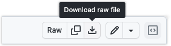

On Linux, the `udev` subsystem manages access to connected USB devices. By default, standard user accounts do not have permission to write directly to serial, USB, or DFU (Device Firmware Upgrade) interfaces of connected hardware.

`udev` rules configure the system to recognize Arduino boards and grant your user account the necessary permissions to access, upload code, and debug. Missing or incorrect `udev` rules can result in failed uploads, as Arduino IDE and other development tools will not be able to access the board (especially when it resets to bootloader or DFU mode).

If you encounter failed uploads, you can resolve the issue by installing the unified Arduino `udev` rules script.

---

## Related Error Messages

If your `udev` rules are missing or configured incorrectly, you may see errors similar to the following depending on your board:

| Boards | Related error output |
| :--- | :--- |
| **GIGA R1 WiFi / Portenta H7 / Portenta C33 / UNO R4** | `dfu-util: Cannot open DFU device 2341:0366 found on devnum X (LIBUSB_ERROR_ACCESS)`<br>`dfu-util: No DFU capable USB device available`<br>`Failed uploading: uploading error: exit status 74` |
| **Nicla Sense ME** | `Error: unable to open CMSIS-DAP device 0x2341:0x60`<br>`Error: unable to find a matching CMSIS-DAP device`<br>`Failed uploading: uploading error: exit status 1` |
| **Nano Every / UNO WiFi Rev2** | `avrdude: jtagmkII_getsync(): sign-on command: status -1`<br>`avrdude: usbdev_open(): cannot open device: Permission denied`<br>`Failed uploading: uploading error: exit status 1` |
| **Nano RP2040 Connect** | `Failed uploading: uploading error: exit status 1` |

---

## How to Install the Unified udev Rules Script

We have created a unified script that configures `udev` rules for all supported Arduino boards in one step.

Follow these steps to download and run the script:

### Step 1: Download the script

You can download the script either using your web browser or directly in the terminal:

* **Option A (Web Browser):** Go to the [unified-arduino-udev-rules.sh file on GitHub](https://github.com/arduino/help-center-content/blob/main/utilities/unified-arduino-udev-rules.sh). Click the **Download raw file** button (the download icon on the top right) to save the file to your computer.

  

* **Option B (Terminal):** Open your terminal and run one of the following command to download the file directly into your current directory:

  ```bash
  wget https://raw.githubusercontent.com/arduino/help-center-content/main/utilities/unified-arduino-udev-rules.sh
  ```

  *or*

  ```bash
  curl -O https://raw.githubusercontent.com/arduino/help-center-content/main/utilities/unified-arduino-udev-rules.sh
  ```

### Step 2: Open the terminal and navigate to the file

If you downloaded the file via Web Browser:

Open your Terminal and navigate to your downloads folder manually:

  ```bash
  cd ~/Downloads
  ```

### Step 3: Grant execution permissions

Before running the script, you must grant it execution permissions so the operating system knows it is allowed to run.

Run the following command:

```bash
chmod +x unified-arduino-udev-rules.sh
```

### Step 4: Run the script as root

The script needs to create a configuration file in a system directory (`/etc/udev/rules.d/`) and reload the `udev` service, which requires administrator (root) privileges.

Run the script using `sudo`:

```bash
sudo ./unified-arduino-udev-rules.sh
```

When prompted, enter your Linux user password and press **Enter**.

### Step 5: Reconnect your board

Once the script completes successfully:

1. Unplug your Arduino board from the USB port.
2. Plug the board back into the USB port.

This forces the system to reload and apply the new `udev` rules to your device. Try uploading your sketch again in the Arduino IDE!
