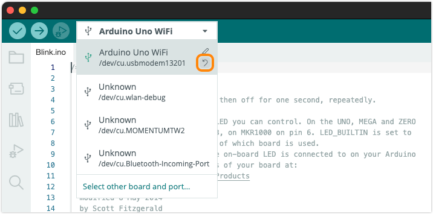

Learn what to do if Arduino IDE misidentifies your board.

In this article:

* [Reset manual board selection](#manual-selection)
* [If your UNO R4 WiFi or Nano ESP32 is identified as a generic ESP32 board](#generic-esp32)

---

## Reset manual board selection

While Arduino IDE will detect and select most boards automatically, the default selection can be overridden with a manual selection. This selection will be remembered the next time you connect the board.

<!-- The reset button will show up under these conditions:

* Arduino IDE identified the port as a single specific board name:
* The board the user selected is different from the board Arduino IDE identified the port as

-->

Open the board selector and look for a **Reset** arrow icon to the right of the currently selected board and port. If the Reset symbol is present, click it to restore the default selection

If the Reset symbol is not present, click "Select other board and port" at the bottom of the list and [manually select the correct board](https://support.arduino.cc/hc/en-us/articles/4406856349970-Select-board-and-port-in-Arduino-IDE#other-board-and-port).

---

## If your UNO R4 WiFi or Nano ESP32 is identified as a generic ESP32 board

* If you're using an **Arduino Nano ESP32**, but it's being detected as a generic ESP32 board, the Arduino bootloader may be missing. To solve the issue, [reset the default Arduino bootloader](https://support.arduino.cc/hc/en-us/articles/9810414060188-Reset-the-Arduino-bootloader-on-the-Nano-ESP32).

* If you're using an **Arduino UNO R4 WiFi**, but it's being detected as an ESP32 board, the USB bridge firmware may be missing. To solve the issue, follow [these instructions to restore the firmware using espflash](https://support.arduino.cc/hc/en-us/articles/9670986058780-Update-the-connectivity-module-firmware-on-UNO-R4-WiFi#espflash).

<!-- markdownlint-disable-file HC001 -->
