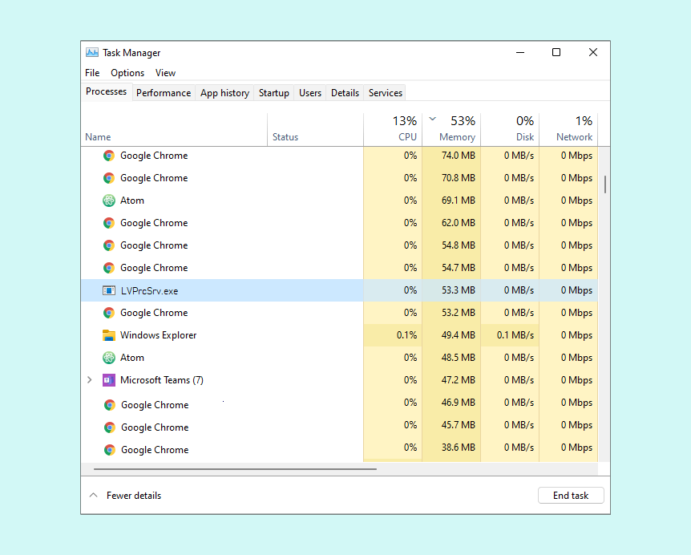

Learn what to do if the Arduino IDE hangs, freezes, or otherwise becomes unresponsive.

> **Note:** This article covers performance issues with the Arduino IDE application, not [errors when uploading](https://support.arduino.cc/hc/en-us/articles/4402764401554).

## Restart Arduino IDE

1. Completely close Arduino IDE.
2. Open Arduino IDE again.

If you are unable to close the application:

1. Open your system's task manager:
   * **Windows:** Press `Ctrl + Alt + Del`). Select 'Task Manager' if prompted.
   * **macOS:** Press `Cmd + Space` and search for 'Activity Monitor'.
   * **Linux:** Depending on your keyboard, press the `Cmd` or `Win` button.
2. Find the 'Arduino' or 'Arduino IDE' process.
3. Terminate the process using the task manager interface.
4. Open Arduino IDE again.

## Restart your PC

If restarting the IDE doesn't fix it you may restart your machine. Make sure your work is saved, and that if there are updates for your OS install them.

## Reinstall using the latest version

1. Do a [complete uninstall](https://support.arduino.cc/hc/en-us/articles/360021325733-How-to-do-a-complete-uninstall-of-the-Arduino-IDE) of Arduino IDE.
2. Download and install the [latest version](https://www.arduino.cc/en/software).
3. Open the updated Arduino IDE.

## Check resource usage

If you see your IDE still getting frozen attempt to find if there is any process that might be interfering with the IDE operation. Processes hogging the machine resources should at this point (if possible) be halted.

1. Open your system's task manager:
   * **Windows:** Press `Ctrl` + `Alt` + `Del`. Select 'Task Manager' if prompted.
   * **macOS:** Press `Cmd` + `Space` and search for 'Activity Monitor'.
   * **Linux:** Depending on your keyboard, press the `Cmd` or `Win` button.
2. Look for CPU or processor usage, as well as memory usage. Sort to find the processes using the most resources. Try closing applications that are using a large amount of resources but **do not terminate system processes**.

Arduino IDE has no stated system requirements but it may have performance issues on significantly older hardware.

## Stop conflicting processes (Windows)

There may be a conflict with the Logitech process `LVPrcSrv.exe`.

* Open the Task Manager (`Ctrl` + `Alt` + `Del`) and see if this process is running, and if so, terminate it.

## If you experience problems only when uploading

Connections to some pins can interfere specifically with the **upload process**.

1. Disconnect the board from your computer.
2. Remove any connection on RX/TX pins.
3. Make sure the Serial Monitor in Arduino IDE is closed.
4. Reconnect the board to your computer.
5. Try uploading the sketch again.

If you have a compatible board, you can also [run a loopback test](https://support.arduino.cc/hc/en-us/articles/360020366520-How-to-do-a-loopback-test) to rule out hardware issues.
