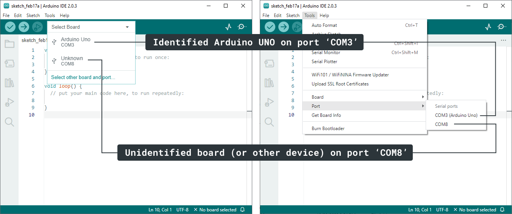

Learn how to troubleshoot and resolve cases where the Arduino IDE shows "Unknown" devices or fails to assign a board name in the board selector and _Tools > Port_ menu.

In this article:

* [Understanding port detection](#understanding-port-detection)
* [Troubleshooting steps](#troubleshooting)

---

## Understanding port detection {#understanding-port-detection}

The Arduino IDE scans the ports on your computer for devices that might be compatible boards. These detected serial ports are shown in both the board selector and the _Tools > Port_ menu.

* **Identified Devices**: If the Arduino IDE recognizes a device as an Arduino board, it displays the board and port in the board selector. In the _Tools > Port_ menu, the board name appears after the port name, enclosed in parentheses.

* **Unidentified Devices**: In some cases, the port information is not sufficient to determine the type of board that's connected, or if the connected device is a compatible board at all. In this case, the device will appear as "Unknown" in the board selector, and only the port name will be shown in the _Tools > Port_ menu.

This example shows the board selector and _Tools > Port_ menu on Windows when an Arduino UNO board and one other unidentified device is connected:

### Types of unidentified ports

The types of unidentified ports shown by Arduino IDE can be grouped in two categories:

* Arduino-compatible boards that use generic USB chips:
  * The "classic" Arduino Nano, which uses a FTDI USB chip.
  * Various "clone" board with generic USB chips such as the CH340.
* Ports that do not belong to an Arduino-compatible device, but are detected and shown by Arduino IDE anyway:
  * Some non-Arduino devices with generic USB chips.
  * Some Bluetooth ports.
  * Debug ports.

> [!NOTE]
> If you have many unidentified ports showing up in the list, consider disconnecting any boards and peripherals you don't need from your computer. Then, use [this procedure](#disconnect-reconnect-procedure) to see whether your board is being detected on any of the ports.

---

## Troubleshooting steps {#troubleshooting}

### 1. Disconnect and reconnect your board to check its port {#disconnect-reconnect-procedure}

**Using the board selector:**

1. Disconnect your board from your computer.

1. Open the board selector menu.

1. Connect your board to your computer.

**Using the _Tools > Board_ menu**:

1. Disconnect your board from your computer.

2. Open the _Tools > Port_ menu. Some ports may still be listed. Take note of this, and close the menu.

3. Connect your board to your computer.

4. Open the _Tools > Port_ menu. The port your board is connected to should now appear as a new port in the list.

### 2. Configure an unidentified board {#configuring-an-unidentified-board}

If you've determined which port belongs to your board:

**Using the board selector:**

1. Open the board selector.

1. Select the "Unknown" board you want to use.

1. In the pop-up "Select Other Board and Port" menu, select the board from the list.

1. Click OK.

**Using the _Tools > Board_ menu**:

1. Open the _Tools > Board_ menu.

1. Choose the board you want to use.

For more information, see [Select board and port in Arduino IDE](https://support.arduino.cc/hc/en-us/articles/4406856349970-Select-board-and-port-in-Arduino-IDE).

---

## Still need help?

* Visit the [Installation & Troubleshooting category](https://forum.arduino.cc/c/18) in the Arduino forum.
* [Contact us](https://www.arduino.cc/en/contact-us/)

<!-- markdownlint-disable-file HC001 -->
