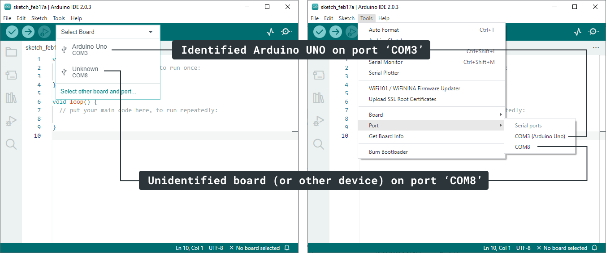

> **Note:** If you're using Arduino IDE 2 and are missing the _Tools > Port_ menu option, it means Arduino IDE did not detect any devices. Proceed with [If no device is detected](#no-device-recognized). In future releases, the Port option will still show (but be disabled) if no ports are available.

Learn what to do if your board is missing from the board selector or _Tools > Port_ menu.

## Before you begin

* Ensure you've connected your board with a working data USB cable.
* Check that your device is powered. One or more more LEDs should be lit.
* If the _Tools > Port_ menu option is missing, it means no ports were found. Proceed with [If your board does not appear on any port](#no-device-recognized).
* Classic Nano boards and some clone boards with generic USB chips will show up as **"Unknown"** in the board selector. When selecting an "Unknown" port you will be prompted to select the board type manually. Alternatively, select your board in the _Tools > Board_ menu.
* If you're using a classic Arduino Nano, you may need to [manually install FTDI drivers](https://support.arduino.cc/hc/en-us/articles/4411305694610-Install-or-update-FTDI-drivers).
* If you're using an Arduino-based "clone" board with a CH340 USB chip, you may need to [manually install CH340 drivers](https://sparks.gogo.co.nz/ch340.html).

## In this article

* [If the Tools > Port menu is missing](#missing-port-menu)
* [If there are "Unknown" devices in the board selector and without a board name in the Tools > Port menu](#unknown-devices)
* [If your board does not appear on any port](#no-device-recognized)

---

## If the Tools > Port menu is missing

If you're using Arduino IDE 2 and are missing the _Tools > Port_ menu option, it means Arduino IDE did not detect any devices. Proceed with [If no device is detected](#no-device-recognized). In future releases, the Port option will still show (but be disabled) if no ports are available.

---

## If there are "Unknown" devices in the board selector and without a board name in the Tools > Port menu

Arduino IDE will list detected serial ports in the board selector and _Tools > Port_ menu.

<!-- When you use Arduino IDE, it will scan the ports on your computer for devices that may be compatible boards. -->

* If Arduino IDE is able to **identify** a device as an Arduino board, it will the board name instead of "Unknown" in the board selector. In the _Tools > Port_ menu, the board name will appear after the port name, enclosed by parentheses.
* In some cases, the port information is not sufficient to determine the type of board that's connected, or if the connected device is a compatible board at alL. In this case, it will appear as an "Unknown" device in the board selector and show only the port name in the _Tools > Port_ menu.

This example shows the board selector and Tools > Port menu on Windows when an Arduino UNO board and one other unidentified device is connected:

The types of unidentified ports shown by Arduino IDE can be grouped in two categories:

* Arduino-compatible boards that use generic USB chips:
  * The "classic" Arduino Nano, which uses a FTDI USB chip.
  * Various "clone" board with generic USB chips such as the CH340.
* Ports that do not belong to an Arduino-compatible device, but are detected and shown by Arduino IDE anyway:
  * Some non-Arduino devices with generic USB chips.
  * Some Bluetooth ports.
  * Debug ports.

> **Note:** If you have many unidentified ports showing up in the list, consider disconnecting any boards and peripherals you don't need from your computer. Then, use [this procedure](#disconnect-reconnect-procedure) to see whether your board is being detected on any of the ports.

### Disconnect and reconnect your board to check its port

**Using the board selector:**

1. Disconnect your board from your computer.

1. Open the board selector menu.

1. Connect your board to your computer.

**If you're using IDE 1, the board selector won't be available. Use the _Tools > Port_ menu instead:**

1. Disconnect your board from your computer.

2. Open the _Tools > Port_ menu. Some ports may still be listed. Take note of this, and close the menu.

3. Connect your board to your computer.

4. Open the _Tools > Port_ menu. The port your board is connected to should now appear as a new port in the list.

### Configure an unidentified board

If you've determined which port belongs to your board:

**Using the board selector:**

1. Open the board selector.

1. Select the "Unknown" board you want to use.

1. In the pop-up "Select Other Board and Port" menu, select the board from the list.

1. Click OK.

**Using the _Tools > Board_ menu**:

1. Open the Tools > Board menu.

1. Choose the board you want to use.

For more information, see [Select board and port in Arduino IDE](https://support.arduino.cc/hc/en-us/articles/4406856349970-Select-board-and-port-in-Arduino-IDE).

---

## If your board does not appear on any port

> **Note:** If the Tools > Port menu is open, you need to close and re-open it for the list to refresh.

If you've determined that none of the listed ports belongs to your board, or of no ports are listed at all, check the following:

### Check board connections

A common reason for the board not appearing on a port is a problem with the USB connection:

1. The board needs to be connected to your computer with a data USB cable.
2. Make sure the USB cable is not damaged. Test your cable with a different device, or try using a different cable.
3. Try using a different USB port on your computer.
4. If possible, connect the board directly to your computer instead of a through a hub.
5. Remove any connections to the **0(RX)** and **1(TX)** pins when uploading code.

### Install missing drivers

Some boards require special drivers for serial communication:

* If you're using a classic Nano, [install the FTDI drivers](https://support.arduino.cc/hc/en-us/articles/4411305694610-Install-or-update-FTDI-drivers).
* If you're using a "clone" board with a CH340 USB chip, you may need to [manually install CH340 drivers](https://sparks.gogo.co.nz/ch340.html).

### Try a bootloader reset if your board supports it

The board may be stuck in a state where it cannot communicate on the port. On some boards (such as those of the MKR Family and newer Nano boards), pressing the RESET button twice in quick succession will put the board in bootloader mode. Instead of running a sketch, the Arduino will wait until a sketch is uploaded. While in bootloader mode, an orange LED will fade in and out.

1. Find the reset button on the board.

2. Click the button two times in succession.

   

3. Check the board selector or Tools > Port again.

### Check for additional system information

If Arduino IDE is not displaying a port for your board, you may still get some information by using a dedicated software utility:

<table>
  <tbody>
    <tr>
      <td>Windows</td>
      <td>
        <ol>
         <li>Open the <b>Device Manager</b> by searching for it in the start menu. You can also try right-clicking the Start button and choosing <i>Device Manager</i>.</li>
         <li>In the Device Manager, open the <i>Other Devices</i> section.</li>
         <li>Review the list of devices.</li>
        </ol>
      </td>
    </tr>
    <tr>
      <td>macOS</td>
      <td>
        <ol>
         <li>Press <code>⌘</code> + <code>Space</code> to open Spotlight. Search for the <b>System Information</b> app and open it.</li>
         <li>Select the <i>Hardware > USB</i> section.</li>
         <li>Review the list of USB devices.</li>
        </ol>
      </td>
    </tr>
    <tr>
      <td>Linux</td>
      <td>
        
Use a device manager of your choice, such as <b>hardinfo</b>.

        
To install and use hardinfo, follow these steps:

        <ol>
         <li>Open Terminal and run <code>sudo apt install hardinfo</code>.</li>
         <li>Wait for the installation to complete, then run the <code>hardinfo</code> command.</li>
         <li>Check <i>Devices > USB Devices</i></li>
         <li>Review the list of USB devices.</li>
        </ol>
    </tr>
  </tbody>
</table>

Here are some cases to look out for:

* Missing drivers can cause your "classic" Nano board to be recognized as **"USB Serial Port"**<!-- on Windows -->, or some other generic name.
* If your board is an UNO or Mega board, missing or corrupted **USB-to-Serial firmware** may cause the board to be recognized as any of the following:

  * Unknown Device
  * Unknown USB Device
  * Composite Device
  * USB Device
  * ATmega16u2 DFU
  * Atmega8U2 DFU

  If your board is listed with one of these names you may resolve the issue by [flashing the USB-to-serial firmware in DFU mode](https://support.arduino.cc/hc/en-us/articles/4408887452434-Flash-USB-to-serial-firmware-in-DFU-mode).

---

## Still need help?

* Visit the [Installation & Troubleshooting category](https://forum.arduino.cc/c/18) in the Arduino forum.
* [Contact us](https://www.arduino.cc/en/contact-us/)

<!-- markdownlint-disable-file HC001 -->
