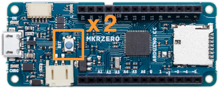

Learn what to do if your Arduino board is missing from the board selector or from the _Tools > Port_ menu in Arduino IDE.

> [!NOTE]
> If you're using Arduino Cloud Editor, see [If your board is not detected by Arduino Cloud Editor](https://support.arduino.cc/hc/en-us/articles/360018131160-If-your-board-is-not-detected-by-Arduino-Cloud-Editor).

## Troubleshooting

### 1. Identify the problem

* **Incorrect Board Identification**: If Arduino IDE incorrectly identifies your board with a generic name or as a different board type, see [If Arduino IDE detects a different board than the one you've connected](https://support.arduino.cc/hc/en-us/articles/12070802257436-If-Arduino-IDE-detects-a-different-board-than-the-one-you-ve-connected) instead.

* **Unknown Devices**: If the board selector in Arduino IDE displays “Unknown” devices, refer to [If there are “Unknown” devices in the board selector and without a board name in the Tools > Port menu](add link) instead.

* **Missing Board**: If your Arduino board is missing from the board selector or from the Tools > Port menu in Arduino IDE, proceed to the instructions below.

### 1. Check board connection

A common reason for a board not being detected is an issue with the USB connection. Follow the steps below to ensure a proper setup:

* *Use a Data USB Cable*: Connect your board with a data USB cable, not a charging-only cable.
* *Test the USB Cable*: Check that the USB cable is not damaged. You can verify this by testing the cable with another device or by trying a different cable.
* *Connect directly*: connect the board directly into your computer instead of through a USB hub.
* *Try a Different USB Port*: If the board is still not detected, connect it to a different USB port on your computer.
* *Check power*: Verify that your device powers on—at least one LED should be lit.
* *Disconnect jumper cables*: Remove any jumper cables connected to the board’s pins, as they may interfere with detection.

### 2. Try a bootloader reset if your board supports it

If the board is still not detected, it might be stuck in a state where it cannot communicate on the port. For some boards (such as those in the MKR Family and newer Nano boards), pressing the RESET button twice in quick succession will activate bootloader mode. Follow the steps below to perform a bootloader reset:

1. Find the reset button on the board.

2. Press the button two times in succession.

   

3. An orange LED will fade in and out, indicating that the board is in bootloader mode,

4. Check the board selector or _Tools > Port_ again to see if your board is now detected.

### 3. Check for additional system information

If Arduino IDE is not displaying a port for your board, you may still get some information by using a dedicated software utility:

<table>
  <tbody>
    <tr>
      <td>Windows</td>
      <td>
        <ol>
         <li>Open the <b>Device Manager</b> by searching for it in the start menu. You can also try right-clicking the Start button and choosing <i>Device Manager</i>.</li>
         <li>In the Device Manager, open the <i>Other Devices</i> section.</li>
         <li>Review the list of devices.</li>
        </ol>
      </td>
    </tr>
    <tr>
      <td>macOS</td>
      <td>
        <ol>
         <li>Press <code>⌘</code> + <code>Space</code> to open Spotlight. Search for the <b>System Information</b> app and open it.</li>
         <li>Select the <i>Hardware > USB</i> section.</li>
         <li>Review the list of USB devices.</li>
        </ol>
      </td>
    </tr>
    <tr>
      <td>Linux</td>
      <td>
        
Use a device manager of your choice, such as <b>hardinfo</b>.

        
To install and use hardinfo, follow these steps:

        <ol>
         <li>Open Terminal and run <code>sudo apt install hardinfo</code>.</li>
         <li>Wait for the installation to complete, then run the <code>hardinfo</code> command.</li>
         <li>Check <i>Devices > USB Devices</i></li>
         <li>Review the list of USB devices.</li>
        </ol>
    </tr>
  </tbody>
</table>

> [!TIP]
> You can use this information to determine if the board is being detected by the computer but not by the Arduino IDE.

---

## Still need help?

* Visit the [Installation & Troubleshooting category](https://forum.arduino.cc/c/18) in the Arduino forum.
* [Contact us](https://www.arduino.cc/en/contact-us/)
