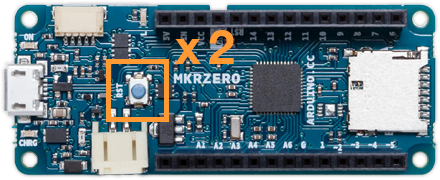

Learn what to do if you’re having issues uploading a sketch to your Arduino device.

---

## Try these steps in order {#top}

1. [Check your sketch for errors](#check-sketch-for-errors)
2. [Select the correct board and port](#select-the-correct-board-and-port)
3. [Check board connection](#check-board-connection)
4. [Try a bootloader reset if your board supports it](#bootloader-reset)
5. [Check for busy or blocked ports](#busy-port)
6. [Delete corrupted files](#delete-corrupted-files)
7. [Check the console output](#check-the-console-output)
8. [Board-specific troubleshooting](#board-specific-troubleshooting)

### Check your sketch for errors {#check-sketch-for-errors}

Click the  **Verify** button to compile your sketch without uploading it. If you still get an error, see [If your sketch doesn't compile](https://support.arduino.cc/hc/en-us/articles/4402764401554-Compilation-errors-when-uploading).

[Back to top](#top)

### Select the correct board and port {#select-the-correct-board-and-port}

Make sure the correct board and port are selected. You can do this using the board selector or the _Tools > Board_ and _Tools > Port_ menus. For detailed instructions, see [Select the right port and board](https://support.arduino.cc/hc/en-us/articles/4406856349970-Select-board-and-port). Then, try uploading your sketch again.

> [!TIP]
> If you're unsure which port is being used, try disconnecting and reconnecting your board. Then, close and reopen the board selector or the _Tools > Port_ menu to refresh the list.

* If your board does not appear in the list or if the _Tools > Port_ option is disabled, see [If your board is not detected by Arduino IDE](https://support.arduino.cc/hc/en-us/articles/4412955149586-If-your-board-is-not-detected-by-Arduino-IDE).

[Back to top](#top)

### Check board connection {#check-board-connection}

Follow the instructions below to ensure a proper setup. After each step, try uploading your sketch again.

1. *Disconnect jumper cables*: Disconnect jumper cables, shields or other devices from the board’s pins, as they may interfere with upload.
1. *Reconnect your board*: Disconnect and reconnect the board to reset its power. Confirm that the power LED (often labeled “ON”) is lit.
1. *Use a data USB Cable*: Connect your board with a data USB cable, not a charging-only cable.
1. *Test the USB cable*: Confirm the cable is working by testing it with another device or trying a different cable.
1. *Connect directly*: Connect the board directly to your computer instead of through a USB hub.
1. *Remove unneeded USB devices*: Disconnect any unnecessary USB devices that might be using the ports.
1. *Try a different USB port*: If the board is still not detected, try a different USB port on your computer.

[Back to top](#top)

### Try a bootloader reset if your board supports it {#bootloader-reset}

If you still can't upload sketches, your board might be stuck in a state where it cannot communicate on the port. For some boards (such as those in the MKR Family and newer Nano boards), pressing the RESET button twice in quick succession will activate bootloader mode. Follow the steps below to perform a bootloader reset:

1. Find the reset button on the board.
1. Press the button two times in quick succession.

   

1. An on-board LED will fade in and out, indicating that the board is in bootloader mode.
1. Check the board selector or _Tools > Port_ again to see if your board is now detected.

[Back to top](#top)

### Check for busy or blocked ports {#busy-port}

After each step, try uploading your sketch again.

1. Ensure only one instance of the Arduino IDE and serial monitor is active, and close other applications that may be using the serial port.
1. If the issue persists, restart your computer.
1. If none of the above worked, see [Find and stop process blocking a port](https://support.arduino.cc/hc/en-us/articles/4407830972050-Find-and-stop-process-blocking-a-port) for advanced troubleshooting.

[Back to top](#top)

### Delete corrupted files {#delete-corrupted-files}

If your board is detected by Arduino IDE but uploads fail, corrupted files might be the cause. To solve this:

1. Delete the [Arduino15](https://support.arduino.cc/hc/en-us/articles/360021325733-Uninstall-Arduino-IDE#Arduino15) folder and the [libraries](https://support.arduino.cc/hc/en-us/articles/360021325733-Uninstall-Arduino-IDE#sketchbook) subfolder.
2. Restart Arduino IDE.
3. [Reinstall the board package](https://support.arduino.cc/hc/en-us/articles/360016119519-Add-boards-to-Arduino-IDE).
4. Try uploading your sketch again.

[Back to top](#top)

### Check the console output {#check-the-console-output}

> [!NOTE]
> _Exit status 1_ only indicates that the upload process has failed. Look for the preceding lines in the error output for more specific information about the failure.

Common errors often involve **dfu-util** and **avrdude** utilities. Learn how to solve:

* [DFU-util errors during upload](https://support.arduino.cc/hc/en-us/articles/11011849739804-dfu-util-errors-when-uploading-exit-status-74#exit-status-74){.link-chevron-right}
* ['Error: avrdude' during upload](https://support.arduino.cc/hc/en-us/articles/4401874331410--Error-avrdude-when-uploading#avrdude-stk500_recv-and-stk500_getsync){.link-chevron-right}

[Back to top](#top)

### Board-specific troubleshooting {#board-specific-troubleshooting}

* **Arduino Nano**:

  * Ensure the [correct processor is selected](https://support.arduino.cc/hc/en-us/articles/4401874304274-Select-the-right-processor-for-Arduino-Nano).
  * You might need to [install FTDI drivers manually](https://support.arduino.cc/hc/en-us/articles/4411305694610-Install-or-update-FTDI-drivers).

* **Boards with the [WCH CH340 USB chip](https://www.wch-ic.com/products/CH340.html)**: See [avrdude: ser_open(): can't set com-state for COMn](https://support.arduino.cc/hc/en-us/articles/13148652511260-avrdude-ser-open-can-t-set-com-state-for-COMn).

[Back to top](#top)

---

## Still need help?

* Visit the [Installation & Troubleshooting category](https://forum.arduino.cc/c/18) in the Arduino forum.

* [Contact us](https://www.arduino.cc/en/contact-us/):

> [!NOTE]
> **Please include this information:**
>
> * A [verbose error output](https://support.arduino.cc/hc/en-us/articles/4407705216274)
> * The name of your board
> * Your operating system
> * Your Arduino IDE version

   Tags: problem uploading to board, problema subiendo a la placa, https://www.arduino.cc/en/Guide/Troubleshooting, 360003198300, 上传失败, 上传出错, 업로드, problème de téléversement vers la carte, téléverser, проблема загрузки в плату, マイコンボードに書き込めない, マイコンボードに書き込もうとしましたが、エラーが発生しました, problem beim hochladen auf das board, problema di caricamento sulla scheda, 업로딩

