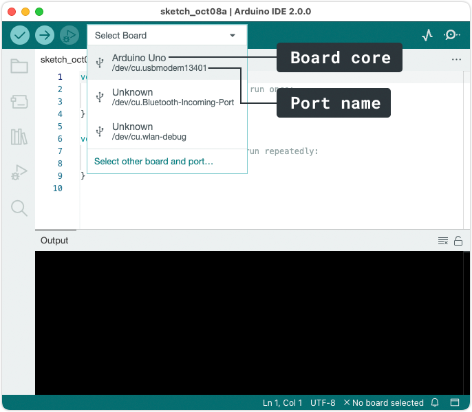
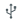
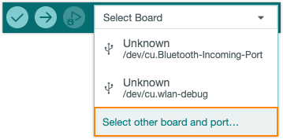
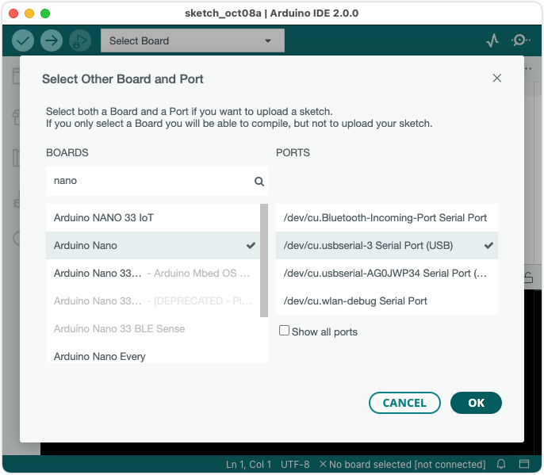
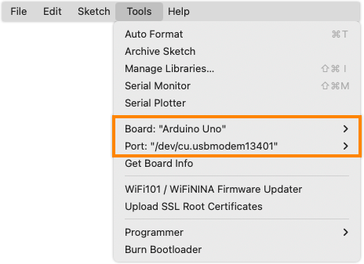

Learn how to select the right board and port in Arduino IDE.

---

It's useful to understand the difference between board and port selections:

* The **board** selection tells Arduino IDE how to compile the sketch and what protocols to use when uploading the sketch. In some cases, it will be automatically set, but it can be overridden with the _Tools > Board_ menu or in the "Select other board and port..." dialog.
* The **port** selection refers to an actual board (or other device) that's connected to your computer. Many boards are automatically recognized by Arduino IDE—these boards will have their name displayed next to their port in the _Tools > Port_ menu and will have their port associated with the identified board in the board selector menu.

Port and board selection can be managed in two ways:

* [Using the board selector (IDE 2)](#selector)
* [Using the Tools menu](#tools-menu)

---

## Using the board selector

> [!NOTE]
> The board selector is only available in IDE 2.

Follow these steps to use a connected board:

1. Find the board selector and click to open.

2. A list of ports will be displayed. If a board could be identified, the board name will be displayed, otherwise, it will display "Unknown".

   

3. Click on a port to select it:

   * If a board was identified, it will automatically be selected. The selected board name will be displayed. The "" indicates that a port is selected.

     

   * If it is unknown, the "Select Other board and port" dialog will open. See [Manually select a board](#other-board-and-port).

   * If the board could be identified, but you are missing the board platform, you may be asked to install it:

     * Select **Yes** to automatically install the board package in the background.

     * Select **Install manually** to view the package in the Board Manager.

     To learn more about installing boards, see [Add a board to Arduino IDE](https://support.arduino.cc/hc/en-us/articles/360016119519-How-to-add-boards-in-the-board-manager).

### Manually select a board

In some cases you may want to individually control the port and board selection:

* Select a board that isn't connected to your computer (you can still write and verify sketches).
* The board cannot be automatically identified.
* The board associated with the port is incorrect.

Follow these steps:

1. Open the board selector and select **Select other board and port**.

   

2. Make your selections:

   * Boards: Type in the text field to filter and scroll in list. Click on a board to select it.

   * Ports: Select a port (optional).

   

3. Click **OK** to save the changes and close the dialog.

---

## Using the Tools menu

The menu bar can be used to perform many actions, including board and port selection.

The menu bar may be anchored to the top of the IDE window or the top of your screen, depending on your system.

### Select board with Tools > Board

Follow these steps:

1. Click on _Tools_ in the menu bar and find the _Board_ row. If a board is currently selected it will be displayed here.

2. Hover over the _Board_ row to reveal the installed board packages. These packages contain some popular boards:

   | Package                                      | Boards                                                                      |
   |----------------------------------------------|-----------------------------------------------------------------------------|
   | Arduino AVR Boards                           | Arduino Uno, Arduino Mega, Arduino Nano (classic)                           |
   | Arduino megaAVR Boards                       | Arduino Uno WiFi Rev2, Arduino Nano Every                                   |
   | Arduino SAMD (32-bits ARM Cortex-M0+) Boards | MKR Zero, MKR WiFi 1000, MKR WiFi 1010, and other MKR boards                |
   | Arduino SAM (32-bits ARM Cortex-M3) Boards   | Arduino Due                                                                 |
   | Mbed OS Nano Boards                          | Arduino Nano 33 BLE, Arduino Nano 33 BLE Sense, Arduino Nano RP2040 Connect |
   | Mbed OS Portenta Boards                      | Portenta H7                                                                 |

   > If you don't know which package to use, or if it's missing from the list, see [Add a board to Arduino IDE](https://support.arduino.cc/hc/en-us/articles/360016119519-How-to-add-boards-in-the-board-manager).

3. Hover over a package to reveal the boards.

4. Click on a board to select it, for example:

   * _Tools > Board > Arduino AVR Boards > Arduino Uno_.
   * _Tools > Board > Mbed OS Nano Boards > Arduino Nano 33 BLE_
   * _Tools > Board > Mbed OS Portenta Boards > Portenta H7_

### Select port with Tools > Port

> [!NOTE]
> In IDE 2, the _Tools > Port_ option will not display if Arduino IDE doesn't detect any ports[^1].

[^1]: [Issue #655](https://github.com/arduino/arduino-ide/issues/655)

Follow these steps:

1. Click on _Tools_ in the menu bar and find the _Port_ row. If a board is currently selected it will be displayed here.

2. Hover over the _Port_ to reveal all ports. For Arduino devices, the board name will typically be displayed after the port, for example:

   * `COM3 (Arduino Uno)`
   * `/dev/cu.usbmodem14101 (Arduino Uno)`
   * `/dev/ttyACM0 (Arduino Uno)`

3. Click on a port to select it.

If you don't see your board in the list, or if the _Port_ option is missing, see [If your board does not appear in the port menu](https://support.arduino.cc/hc/en-us/articles/4412955149586-If-your-board-does-not-appear-in-the-port-menu).
