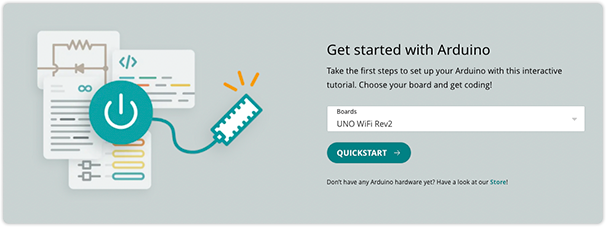
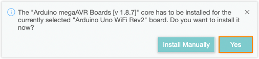
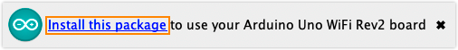
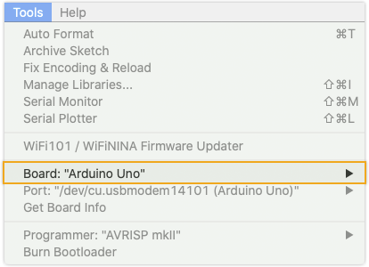
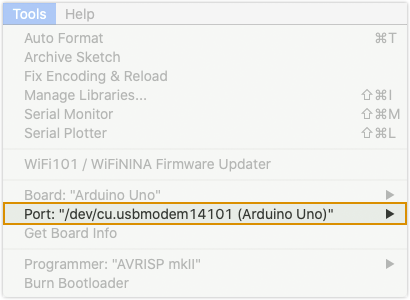

> Board-specific quickstart guides are available in [Arduino Docs](https://docs.arduino.cc/).
>
> 

Learn the basics of uploading a sketch in Arduino IDE:

1. [Open Arduino IDE](#get-ide)
2. [Connect the board to your computer](#connect)
3. [Board package installation](#package-installation)
4. [Select board and port](#select-board-and-port)
5. [Upload a sketch](#upload)

**What you'll need:**

* A computer running Windows, macOS or Linux
* Arduino IDE
* An Arduino board
* A compatible data USB cable

---

## 1. Open Arduino IDE

If you haven't done so already, download Arduino IDE from the [software page](https://www.arduino.cc/en/software). You can find [installation instructions here](https://support.arduino.cc/hc/en-us/articles/360019833020).

## 2. Connect the board to your computer

Next, connect to board to your computer with a USB cable. This will both power the board and allow the IDE to send instructions to the board. You'll need a data USB cable (a charge-only cable will not work), with connectors that fit both the board and your computer.

Arduino boards use different USB connectors:

* USB-B (UNO Rev3, UNO WiFi Rev2, Mega boards)
* Mini-B USB (Nano)
* Micro-B (Nano Family boards (except the classic Nano), MKR Family boards)
* USB-C (Portenta boards, UNO Mini Limited Edition)

The most common USB connector is USB-A, but newer laptop computers may only have USB-C.

## 3. Install board package

To compile and upload sketches for your board Arduino IDE needs a collection of files for that board called a **board package**.

When Arduino IDE detects a board with a missing board package, it may ask you to install the missing files:

* In IDE 2, click **Yes**.

  

* In IDE 1, click **Install this package**:

  

If no prompt appears, proceed with the next step. If you at any point need to manually find and add a missing board package, see [Add boards to Arduino IDE](https://support.arduino.cc/hc/en-us/articles/360016119519-Add-boards-to-Arduino-IDE).

## 4. Select board and port

Port and board selection can be managed in two ways:

* [Using the board selector (requires IDE 2)](#selector)
* [Using the Tools menu](#tools-menu)

### Using the board selector

> [!NOTE]
> The board selector is only available in IDE 2.

Follow these steps to use a connected board:

1. Find the board selector and click to open.

2. A list of ports will be displayed. If a board could be identified, the board name will be displayed, otherwise, it will display "Unknown".

   

3. Click on a port to select it.

When you select a board, the following may occur:

* If it is unknown, the "Select Other board and port" dialog will open. See [Select board and port in Arduino IDE](https://support.arduino.cc/hc/en-us/articles/4406856349970#other-board-and-port) for details.

* If the board could be identified, but you are missing the board platform, you may be asked to install it:

  * Select **Yes** to automatically install the board package in the background.

  * Select **Install manually** to view the package in the Board Manager.

 To learn more about installing boards, see [Add a board to Arduino IDE](https://support.arduino.cc/hc/en-us/articles/360016119519-How-to-add-boards-in-the-board-manager).

### Using the Tools menu

**Select board:**

1. Click on _Tools_ in the menu bar and find the _Board_ row. If a board is currently selected it will be displayed here.

   

2. Hover over the _Board_ row to reveal the installed board packages. These packages contain some popular boards:

   | Package                                      | Boards                                                                      |
   |----------------------------------------------|-----------------------------------------------------------------------------|
   | Arduino AVR boards                           | Arduino Uno, Arduino Mega, Arduino Nano (classic)                           |
   | Arduino megaAVR boards                       | Arduino Uno WiFi Rev2, Arduino Nano Every                                   |
   | Arduino SAMD (32-bits ARM Cortex-M0+) Boards | MKR Zero, MKR WiFi 1000, MKR WiFi 1010, and other MKR boards                |
   | Mbed OS Nano boards                          | Arduino Nano 33 BLE, Arduino Nano 33 BLE Sense, Arduino Nano RP2040 Connect |

   > **Troubleshooting:** If you don't know which package to use, or if it's missing from the list, see [Add a board to Arduino IDE](https://support.arduino.cc/hc/en-us/articles/360016119519-How-to-add-boards-in-the-board-manager).

3. Click on a board to select it.

**Select port:**

> [!NOTE]
> In IDE 2, the _Tools > Port_ option will not display if Arduino IDE doesn't detect any ports.

1. Click on _Tools_ in the menu bar and find the _Port_ row. If a board is currently selected it will be displayed here.

   

2. Hover over the _Port_ to reveal all ports. For Arduino devices, the board name will typically be displayed after the port, for example:

   * `COM3 (Arduino Uno)`
   * `/dev/cu.usbmodem14101 (Arduino Uno)`
   * `/dev/ttyACM0 (Arduino Uno)`

3. Click on a port to select it. If the port with your board is already selected you don't have to do anything. If you don't see your board in the list, see [If your board does not appear in the port menu](https://support.arduino.cc/hc/en-us/articles/4412955149586-If-your-board-does-not-appear-in-the-port-menu).

   > **Troubleshooting:** If you don't see your board in the list, or if the port menu is missing, see [If your board does not appear in the port menu](https://support.arduino.cc/hc/en-us/articles/4412955149586-If-your-board-does-not-appear-in-the-port-menu).

## 5. Upload a sketch

1. Write a sketch, or use an Example such as [Blink](https://www.arduino.cc/en/Tutorial/BuiltInExamples/Blink) (_File > Examples > 01.Basics > Blink_).

2. **Optional:** Click the  **Verify** button to try compiling the sketch and check for errors.

3. Click the  **Upload** button to program the board with the sketch.

Your sketch will start running on the board. It will run again each time the board is reset.

---

## Troubleshooting

* Make sure you've followed the steps before, especially selecting the board and port correctly.
* If you can't find your board in the port menu, or if the _Tools > Port_ port menu is missing, see [If your board does not appear in the port menu](https://support.arduino.cc/hc/en-us/articles/4412955149586-If-your-board-does-not-appear-in-the-port-menu).
* If you get an upload error, see [Errors when uploading a sketch](https://support.arduino.cc/hc/en-us/articles/4403365313810-Errors-when-uploading-a-sketch).
