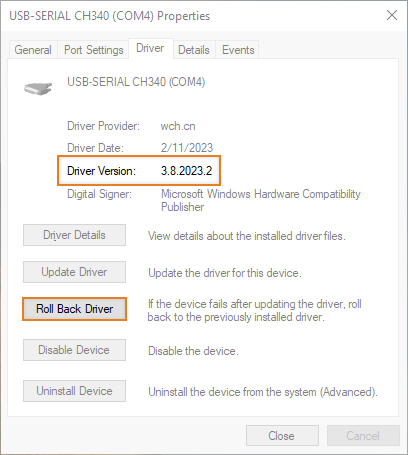

An "`avrdude: ser_open(): can't set com-state for COMn`" error can occur when uploading to Arduino-compatible boards that use specific batches of the **WCH CH340 USB chip**. The problem only occurs when using the latest version of the CH340 driver, and can be solved by installing a previous release.

---

## Download and install version 3.7.2022.01 of the driver

Follow these steps:

1. Download [version 3.7.2022.01 of the driver](https://www.wch-ic.com/downloads/file/65.html?time=2023-03-16%2022:57:59){.link-download}.

1. Run the downloaded `CH341SER.EXE` file.

1. A **User Account Control** dialog may now appear. Click the `Yes` button.

1. A **DriverSetup(X64)** dialog will appear. Click the `Install` button.

1. Restart Arduino IDE and try to upload the sketch again.

To prevent Windows from automatically updating back to an incompatible version of the driver, use the [Roll back driver feature in Device Manager](#rollback).

## Roll back the driver to stop automatic updates {#rollback}

Follow these steps:

1. Close the **DriverSetup(X64)** dialog and **Arduino IDE** if they are running.

1. Connect the Arduino board to your computer with a USB cable.

1. Open **Device Manager** from the Windows Start Menu.

1. Check your View settings:

    * View > Devices By Type should be selected.

    * Show Hidden Devices should be **not** be selected.

    

1. Open the `Ports (COM & LPT)` section. You should see a port identified as `USB-SERIAL CH340 (COM_n_)`

    

    Right-click on it and select **Properties**.

1. Select the `Driver` tab and confirm that 3.7.2022.1 is the installed driver version.

   

1. To enable rolling back to version 3.7.2022.1, we need to switch to a different driver. Select **Update Driver > Search automatically for drivers**. You should now see the driver installation wizard update the driver to a more recent version.

   > [!WARNING]
   > It is possible you will instead see the message "The best drivers are already installed". If so, follow these steps:
   >
   > 1. Close the Driver update dialog.
   > 1. Download and install [version 3.8.2023.2 of the driver](https://www.wch.cn/downloads/file/65.html?time=2023-03-17%2016:47:34){.link-download}
   > 1. Go back to device properties and select **Update Driver > Browse my computer for drivers > Let me pick from a list of available drivers on my computer** and install version 3.7.2022.1 again.
   > 1. Finally, try **Update Driver > Search automatically for drivers** again.

1. Confirm that the installed version is now 3.8.2023.2 (or later) and click the `Roll Back Driver` button.

   

1. Now that the **Driver Package rollback** dialog is open, click the radio button next to **My apps don't work with this driver** and press the `Yes` button to roll back the driver.
