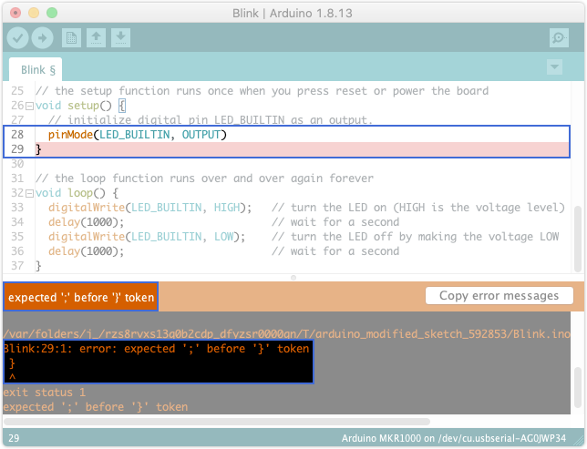
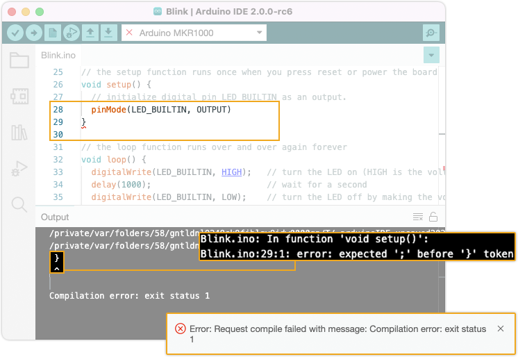

Learn about compilation errors in your sketch and how to resolve them.

---

## What is a compilation error?

Make sure your error occurs during compilation by clicking  **Verify** instead of  **Upload**. This will compile the sketch without attempting to upload it. A successful compilation will complete with a message like this:

```
Sketch uses 11604 bytes (4%) of program storage space. Maximum is 262144 bytes.
Global variables use 2980 bytes (9%) of dynamic memory, leaving 29788 bytes for local variables. Maximum is 32768 bytes.
```
If your error only occurs when uploading, see [Errors when uploading a sketch](https://support.arduino.cc/hc/en-us/articles/4403365313810-Errors-when-uploading-a-sketch).

## Interpeting the error message

1. Check the console output for information. Many error messages will point out the problem.
2. If the error occured on a specific line, it will be highlighted in the editor (IDE 1.x only). In the example below, the error is caused by a missing semicolon on line 29.

   
   _IDE1_

   

* If you're unsure whether your error is due to compilation, you can click the  **Verify** button. The IDE will try to compile the sketch, without uploading it to the board. This will compile and verify the sketch without uploading it to the board. A successful compilation finishes with this message:

  ```
  Sketch uses 11604 bytes (4%) of program storage space. Maximum is 262144 bytes.
  Global variables use 2980 bytes (9%) of dynamic memory, leaving 29788 bytes for local variables. Maximum is 32768 bytes.
  ```

  If your sketch compiles, and you only get the error when uploading, see [Errors when uploading a sketch](https://support.arduino.cc/hc/en-us/articles/4403365313810-Errors-when-uploading-a-sketch).

When the sketch is compiled correctly the output will look similar to this.

---

## List of errors

<table>
<tr>
<td style="vertical-align: top;">
<h3>Common</h3>
<li><a href="#error-compiling-for-board">Error compiling for board</a></li>
<li><a href="#missing-FQBN">Compilation error: Missing FQBN (Fully Qualified Board Name)</a></li>
<li><a href="#platform-not-installed">Compilation error: Error: 2 UNKNOWN: platform not installed</a></li>
<h3>Required functions</h3>
<ul>
<li><a href="#required-functions">undefined reference to 'setup'</a></li>
<li><a href="#required-functions">undefined reference to 'loop'</a></li>
<li><a href="#required-functions">collect2: error: ld returned 1 exit status</a></li>
</ul>
<h3>Libraries</h3>
<ul>
<li><a href="#fatal-error-no-such-file-or-directory">fatal error: : No such file or directory</a></li>
</ul>
</td>
<td style="vertical-align: top;">
<h3>Syntax errors</h3>
<ul>
<li><a href="#">variable was not declared in this scope</a></li>
<li><a href="#">expected unqualified-id before numeric constant</a></li>
<li><a href="#">expected ',' or ';' before ':' token</a></li>
<li><a href="#"></a></li>
<li><a href="#"></a></li>
<li><a href="#"></a></li>
<li><a href="#"></a></li>
</ul>
</td>
</tr>
</table>

<!-- COMMON -->

<a id="missing-FQBN"></a>

### Compilation error: Missing FQBN (Fully Qualified Board Name)

When compiling or uploading, the following error appears in the output panel.

```
Compilation error: Missing FQBN (Fully Qualified Board Name)
```

When compiling or uploading code, this error will occur if no board is selected, or if the board core is not installed.

Note that a board needs to be selected even if you're not uploading any code.

<a id="platform-not-installed"></a>

### Compilation error: Error: 2 UNKNOWN: platform not installed

When compiling or uploading, the following error appears in the output panel.

```
Compilation error: Error: 2 UNKNOWN: platform not installed
```

This error appears when the required *board core* is not installed. Please ensure the core is installed using [this guide](https://www.arduino.cc/en/Tutorial/getting-started-with-ide-v2/ide-v2-board-manager#installing-a-core).

<!-- REQUIRED FUNCTIONS -->

<a id="required-functions"></a>

### undefined reference to 'setup' or 'loop'<br>collect2: error: ld returned 1 exit status

Note that the sketch *must* contain a `setup()` and `loop()` function. If these are missing, or if their names have been changed, the compiler will return this error.

```
<path>: In function `main':
<path>: undefined reference to `setup'
collect2: error: ld returned 1 exit status
exit status 1
```

<!-- LIBRARIES -->

## Libraries

<a id="fatal-error-no-such-file-or-directory"></a>

### fatal error: <library>: No such file or directory

1. Check that the library name is spelled correctly and included with the proper format, e.g. `#include <SPI.h>`.
2. Import the `.h` file.

```
sketch_may11a:22:10: fatal error: KeyboardController.h: No such file or directory
 #include <KeyboardController.h>
          ^~~~~~~~~~~~~~~~~~~~~~
compilation terminated.
exit status 1
KeyboardController.h: No such file or directory

```

<!-- SYNTAX -->

## Syntax errors

A *syntax error* appears when your sketch violates the rules of the programming language. These errors need to be fixed before the sketch can be compiled and uploaded to the board.

The error will be printed in the IDE console, and will typically contain a description of the error, as well as the line number where it occurred. Enabling line numbers in Preferences can be helpful, but the line will also be highlighted by the IDE.

In the example below, the error is caused by a missing semicolon on line 29.


If you're unsure whether your error is due to compilation, you can click the  **Verify** button. This will compile and verify the sketch without uploading it to the board. When the sketch is compiled correctly the output will look similar to this.

```
Sketch uses 924 bytes (2%) of program storage space. Maximum is 32256 bytes.
Global variables use 9 bytes (0%) of dynamic memory, leaving 2039 bytes for local variables. Maximum is 2048 bytes.
```

### variable was not declared in this scope

```
i = 0;
^
exit status 1
'i' was not declared in this scope
```

### expected unqualified-id before numeric constant

```
/var/folders/58/gntldnl9249ck9fjblgv9jdw0000gp/T/arduino_modified_sketch_490052/sketch_may11b.ino: In function 'void setup()':
sketch_may11b:3:18: error: expected unqualified-id before numeric constant
    int myInt = 1,0;
                  ^
exit status 1
expected unqualified-id before numeric constant
```

### expected ',' or ';' before ':' token

```
/var/folders/58/gntldnl9249ck9fjblgv9jdw0000gp/T/arduino_modified_sketch_886724/sketch_may11b.ino: In function 'void setup()':
sketch_may11b:3:19: error: expected ',' or ';' before ':' token
    int myInt = 1.0:
                   ^
exit status 1
expected ',' or ';' before ':' token
```

---

## Still need help?

* Arduino sketches are written in the Arduino language, which is based on standard C++ language. Most likely you will find a wealth of resources by searching `C++ <error message>` in your search engine.

* For help with functions specific to Arduino, see the [Arduino functions reference](https://www.arduino.cc/reference/en/).

* Visit the [Programming Questions category](https://forum.arduino.cc/c/20) in the Arduino forum. Start by reading the pinned threads which will contain useful information on how to best post a question.

---

## Further reading

* [Troubleshooting Guide For Arduino > Compiling](https://per1234.github.io/ino-troubleshooting/compiling.html)
