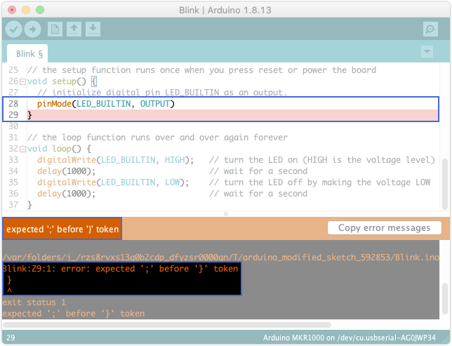
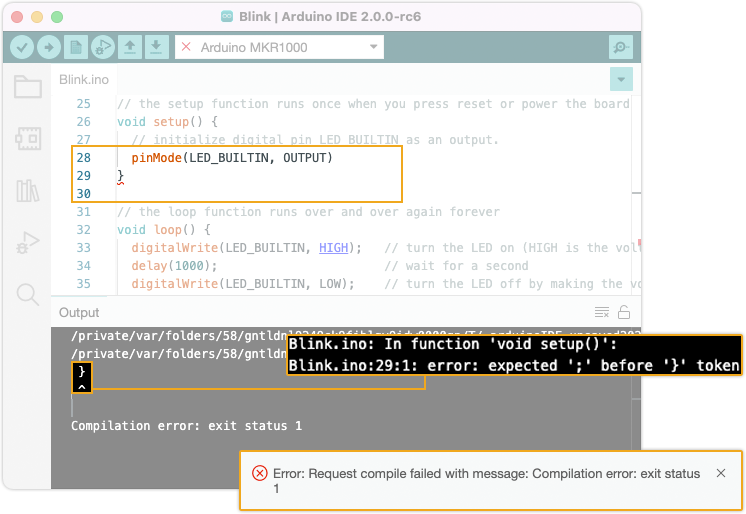

Learn about compilation errors in your sketch and how to resolve them.

---

## Quick checks

* Make sure your error occurs during compilation by clicking  **Verify** instead of  **Upload**. This will compile the sketch without attempting to upload it. If your error only occurs when uploading, see [Errors when uploading a sketch](https://support.arduino.cc/hc/en-us/articles/4403365313810-Errors-when-uploading-a-sketch).

* A successful compilation will always finish with this message:

  ```
  Sketch uses 11604 bytes (4%) of program storage space. Maximum is 262144 bytes.
  Global variables use 2980 bytes (9%) of dynamic memory, leaving 29788 bytes for local variables. Maximum is 32768 bytes.
  ```

* A sketch always needs to include a `setup()` and `loop()` function, even if they're not being used. You can use _File > Examples > 1.Basics > BareMinium_ as a template.

* Libraries added with `#include` need to be installed. Try searching for the library name in the Library Manager (_Tools > Manage Libraries..._).

---

## Interpreting the error message

Arduino IDE displays compilation messages differently depending on the version:

1. Check the IDE error message.
   * In IDE 1.x, it is displayed above the console window.
   * In IDE 2.x, it is displayed in a bottom-right pop-up.
   Sometimes, preceding lines can be more informative — check the console output.

2. Check the console output.
   * Compilation errors will often reference the row and column where the error was triggered, i.g. `Blink:29:1` (line 29, 1 column).
   * You may have to scroll or expand the window width to see the entire message.

3. Look for highlights in the editor:
   * In IDE 1.x, the **line** where the error occurred is highlighted in red.
   * In IDE 2.x, the **character** where the error occurred is underlined in red.
   * The line causing the error may be before the line where it was triggered. In the example above, line 28 is missing a semicolon (`;`), but the error will be triggered by the unexpected closing bracket (`}`) in line 29.

   <table class="img-captions">
     <tr>
        <td></td>
        <td></td>
     </tr>
     <tr>
        <td>Error output in IDE 1.x.</td>
        <td>Error output in IDE 2.x.</td>
     </tr>
   </table>

---

## Troubleshoot a specific error

<table>
<tr>
<td style="vertical-align: top;">
<h3>Common</h3>
<li><a href="#error-compiling-for-board">Error compiling for board</a></li>
<li><a href="#missing-FQBN">Compilation error: Missing FQBN (Fully Qualified Board Name)</a></li>
<li><a href="#platform-not-installed">Compilation error: Error: 2 UNKNOWN: platform not installed</a></li>
<h3>Required functions</h3>
<ul>
<li><a href="#required-functions">undefined reference to 'setup'</a></li>
<li><a href="#required-functions">undefined reference to 'loop'</a></li>
<li><a href="#required-functions">collect2: error: ld returned 1 exit status</a></li>
</ul>
<h3>Libraries</h3>
<ul>
<li><a href="#fatal-error-no-such-file-or-directory">fatal error: : No such file or directory</a></li>
</ul>
</td>
<td style="vertical-align: top;">
<h3>Syntax errors</h3>
<ul>
<li><a href="#">variable was not declared in this scope</a></li>
<li><a href="#">expected unqualified-id before numeric constant</a></li>
<li><a href="#">expected ',' or ';' before ':' token</a></li>
<li><a href="#"></a></li>
<li><a href="#"></a></li>
<li><a href="#"></a></li>
<li><a href="#"></a></li>
</ul>
</td>
</tr>
</table>

<!-- COMMON -->

<a id="missing-FQBN"></a>

### Compilation error: Missing FQBN (Fully Qualified Board Name)

When compiling or uploading code, this error will occur if no board is selected, or if the board core is not installed.

A board needs to be selected even if you're not uploading any code.

<a id="platform-not-installed"></a>

### Compilation error: Error: 2 UNKNOWN: platform not installed

This error occurs when the required *board core* is not installed. Please ensure the core is installed using [this guide](https://www.arduino.cc/en/Tutorial/getting-started-with-ide-v2/ide-v2-board-manager#installing-a-core).

<!-- REQUIRED FUNCTIONS -->

<a id="required-functions"></a>

### undefined reference to 'setup' or 'loop'<br>collect2: error: ld returned 1 exit status

Occurs when the `setup()` or `loop()` functions are missing. Your sketch _must_ include these functions, even if they're not being used. You can use _File > Examples > 1.Basics > BareMinimum_ as a template. Note that function names are case-sensitive and that the compiler will handle something like `Setup()` (with a capital S) as a completely different function.

<!-- LIBRARIES -->

<a id="fatal-error-no-such-file-or-directory"></a>

### fatal error: \<library\>: No such file or directory

For example:

```
sketch_may11a:22:10: fatal error: KeyboardController.h: No such file or directory
 #include <KeyboardController.h>
          ^~~~~~~~~~~~~~~~~~~~~~
compilation terminated.
exit status 1
KeyboardController.h: No such file or directory
```

1. Check that the library name is spelled correctly and included with the proper format, e.g. `#include <SPI.h>`.
2. Make sure to import the `.h` file.

<!-- SYNTAX -->

### variable was not declared in this scope

Occurs when a variable is accessed before being declared with the proper syntax, e.g. `int i = 5`, or if the variable is declared outside the current scope.

In this exampled, the variable `i` is declared in the `setup()` function, and then accessed in the `loop()` function.

```
void setup() {
  // put your setup code here, to run once:
  int i = 5;
}

void loop() {
  // put your main code here, to run repeatedly:
  i = i + 1;
}
```

Because the `setup()` function's scope is not accessible from `loop()`, the compiler will return this error:

```
sketch_may16a:3:3: error: 'i' was not declared in this scope
i = 5;
^
exit status 1
'i' was not declared in this scope
```

Instead of declaring `i` in `setup()`, it can be declared as a _global variable_:

```
int i = 5;

void setup() {
  // put your setup code here, to run once
}

void loop() {
  // put your main code here, to run repeatedly:
  i = i + 1;
}
```

### expected unqualified-id before numeric constant

Will occur if a comma (`,`) is used as a decimal separator instead of period (`.`).

This float is incorrectly assigned `1,1`:

```
float f = 1,1;
```

It will trigger this error:

```
sketch_may16a:3:15: error: expected unqualified-id before numeric constant
   float f = 1,1;
               ^
exit status 1
```

Instead, use a decimal point (`.`):

```
float f = 1.1;
```

### expected ',' or ';' before ':' token

```
sketch_may16a:3:19: error: expected ',' or ';' before ':' token
    int i = 1:
                   ^
exit status 1
```

This error occurs because a line has been ending with a colon (`:`)
instead of a semicolon. (`;`). The line should look like this:

```
int i = 1;
```

### 'expected declaration before '}' token', or 'expected '}' at end of input'

These errors can occur when brackets (`{` and `}` are incorrectly used.

1. Make sure that brackets are opened and closed in the expected order.
2. Use _Tools > Auto Format_ to make your code more readable.
3. If you click on a bracket, the associated opening or closing bracket will be highlighted.

---

## Still need help?

* Arduino sketches are written in the Arduino language, which is based on standard C++ language. Most likely you will find a wealth of resources by searching `C++ <error message>` in your search engine.

* For help with functions specific to Arduino, see the [Arduino functions reference](https://www.arduino.cc/reference/en/).

* Visit the [Programming Questions category](https://forum.arduino.cc/c/20) in the Arduino forum. Start by reading the pinned threads which will contain useful information on how to best post a question.

* See [Troubleshooting Guide For Arduino > Compiling](https://per1234.github.io/ino-troubleshooting/compiling.html).

<!-- markdownlint-disable-file HC001 -->
