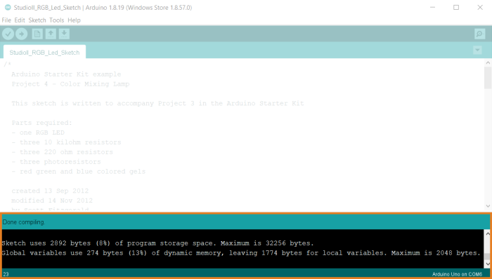

The IDE always checks for storage space and dynamic memory usage when compiling your code and prints the results to the console.

* If both values are **below** 100%, you don't need to do anything.

* If either storage space or dynamic memory usage is **above** 100%, you have to free up storage space or optimize your code. See [Reduce the size and memory usage of your sketch](https://support.arduino.cc/hc/en-us/articles/360013825179-Reduce-the-size-and-memory-usage-of-your-sketch) for more information.
