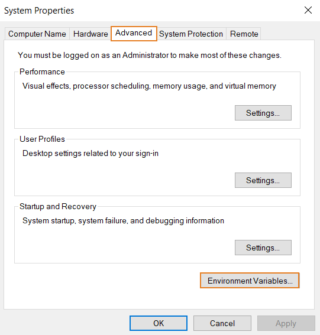
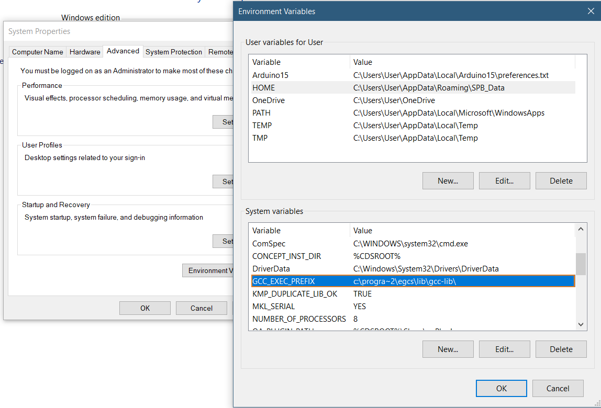
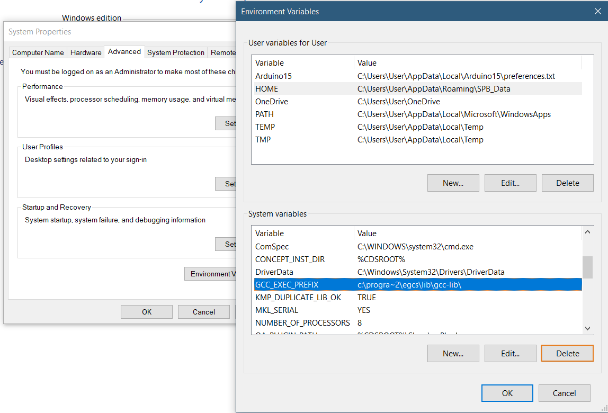

This error appears during compilation in the console, it is caused by an extra file inside the system properties. You will read here the steps to take in order to avoid it.

## Steps

1. Right click the Start button.

2. Click "Run".

   

3. Type "`sysdm.cpl`".

   

4. Click the "OK" button. "System Properties" should now open.

5. Click the "Advanced" tab.

6. Click the "Environment variables..." button.

   

7. Under "System variables", scroll down until you see "GCC_EXEC_PREFIX". Click on it.

   

8. Click the "Delete" button.

   

9. Click the "OK" button.

10. Close System Properties.

11. Open the IDE again and try to upload your sketch the error should no longer occur.
