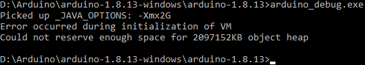

If the Arduino IDE won't start on Windows (the initialization window appears and disappears without showing any error message or warning), try running `arduino_debug.exe` from within the Arduino root folder, which is in `C:\Program Files (x86)\Arduino\` by default.

If you get something like the following output there is an issue with the Java memory allocation.



Follow these steps to work around it:

1. In the Arduino root folder, open the file `arduino.l4j.ini` with a text editor.
2. Find the line starting with `-Xmx`. By default, it should be `-Xmx512M`. If this is not the case, change the line to read `-Xmx512M`.
3. Try running `arduino_debug.exe` again.

If it still gives the same error, the reason may be that the setting is being overridden by the `_JAVA_OPTIONS` environment variable. To test this, run the following command from the `cmd` command line in the Arduino root folder.

```
set _JAVA_OPTIONS=
```

From the same `cmd` session, run the exe.

```
arduino_debug.exe
```

The IDE should now start. But note that the `_JAVA_OPTIONS` is only unset in the current `cmd` session. To make the change permanent, it needs to be unset on the system and/or user level, which is outside the scope of this article. Note that setting the variable in this way may interfere with other applications on your system.
