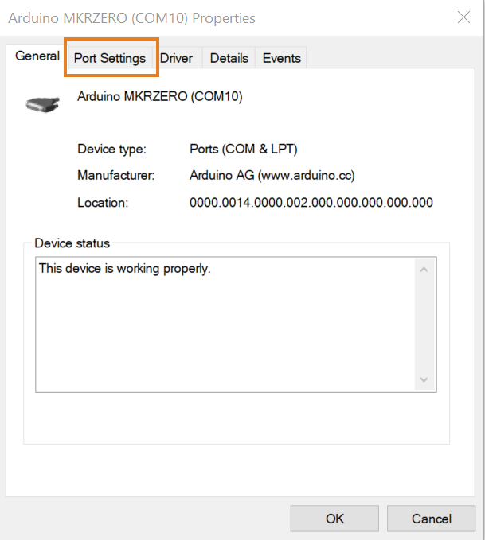

The serial number of an Arduino board differs depending to the mode the board is functioning on. For example, on bootloader mode the serial number presented to Windows' `Device Manager` is different to the serial number of the board when it is on application mode.

Windows enumerates a new different COM port for every serial number or VID/PID detected. Also, a new COM port will be enabled if the device is connected to a different physical USB port. Therefore, the same device on the same port can have different COM port numbers depending on the its functioning mode or the USB port it is connected to.

Of course, the COM port number will be reflected on Arduino IDE but this is not a problem to upload sketches and the board will function as usual.

It is possible to force the COM port to remain with the same number if that is what is required. All that needs to be done is:

1. In the `Device manager`, right click on the specific COM port and select `port properties`.

    

2. Click on the `settings` tab and go to `advanced`.

   

3. Change port number to the one you like.

   

If you pick a COM number that has already been assigned, Windows might complain saying it is already in use. This is fine as long as you assign the same port number for all the possibilities of the same board.

On Linux, devices are enumerated depending on what is previously connected. So, if you have no other ports 'ttyACM0' will be always enabled. However, if for some reason the board gets reset or disconnected with the port open in a terminal, then it will be listed on the next available port.

