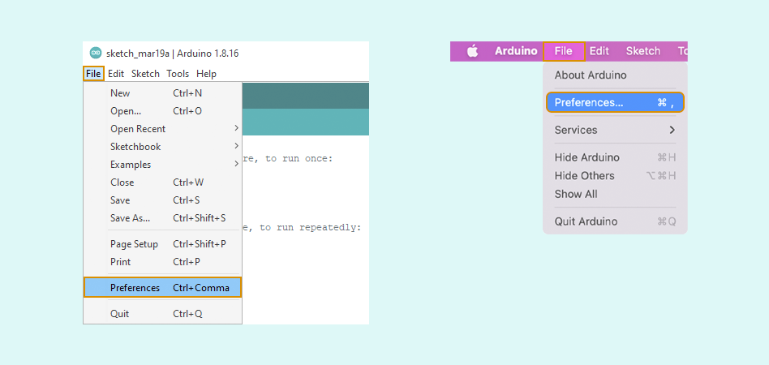
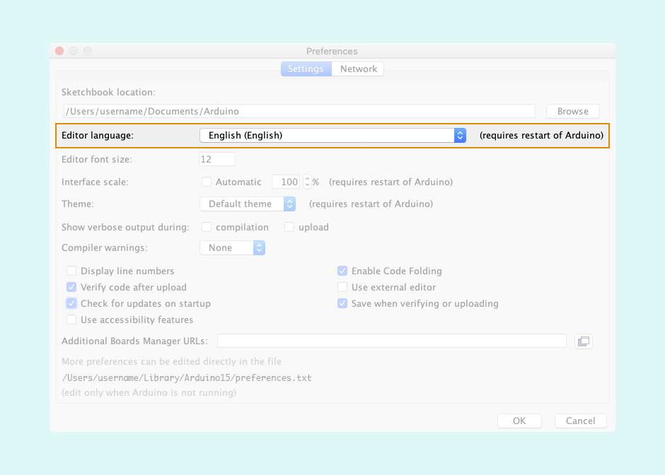
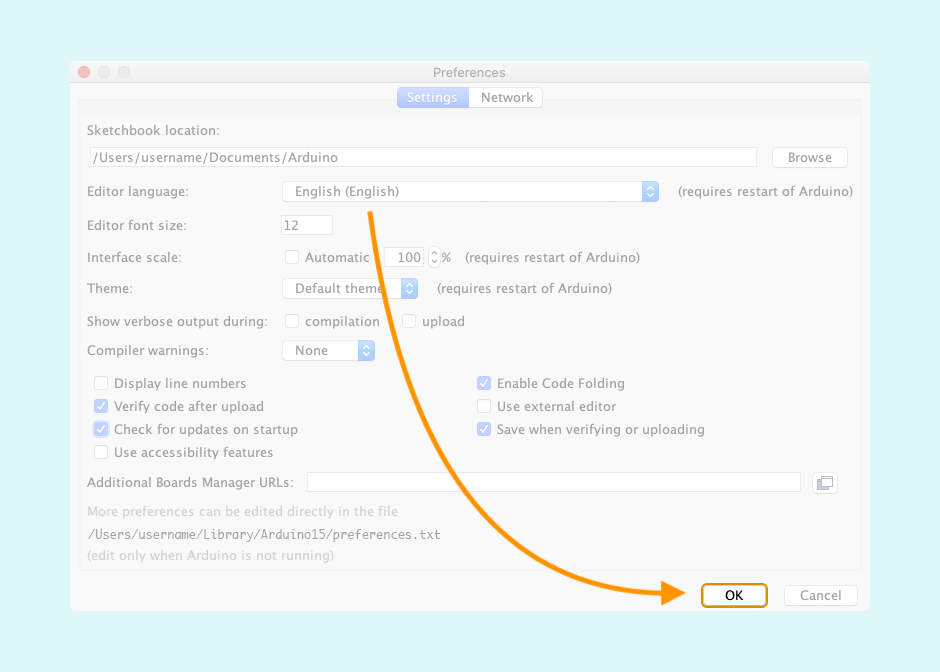
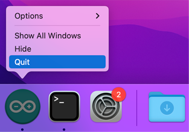

> **Note:** Community translations were added to Arduino IDE 2.0 in version **2.0.0-rc6**. You can find the latest version on the [Software page](https://www.arduino.cc/en/software). <!-- TEMP_NOTICE: 22-04-27 -->

The original language for the Arduino IDE interface is English, but other languages are available.

---

## Change the language in Preferences

1. Open Arduino IDE.

2. Open preferences: Choose _File > Preferences_ in the menu bar for Windows/Linux or  _Arduino > Preferences_ for macOS.

     

   Alternatively, use keyboard shortcuts to open the window: `Ctrl + ,` for Windows/Linux and `CMD + ,` for macOS.

3. Click the **Editor language** option and select your desired language.

   

4. Click OK to confirm the changes.

   

5. Restart the IDE for the changes to take effect.

---

## Change the language by editing preferences.txt

Alternatively, you can edit the `preferences.txt` file directly.

1. Close Arduino IDE.

2. [Open the Arduino15 folder](https://support.arduino.cc/hc/en-us/articles/360018448279-Open-the-Arduino15-folder).

3. Open `preferences.txt`.

4. Find the `editor.languages.current` line.

5. Edit the value to read `editor.languages.current=en`.

6. Save the file.

7. Open Arduino IDE to see the changes.

---

## Troubleshooting

### If only English is available in 2.0

Community translations were added to Arduino IDE 2.0 in version **2.0.0-rc6**.

You can find the latest version on the [Software page](https://www.arduino.cc/en/software).

### Some text is not translated

Arduino IDE translations have been made through community contributions, and not all of them are complete. You can see the status of each language at **Transifex**:

* [Arduino IDE translation project](https://www.transifex.com/mbanzi/arduino-ide-15/)
* [Arduino IDE 2.0 translation project](https://www.transifex.com/arduino-1/ide2/)

### If the language isn't changing

Make sure you fully restart Arduino IDE.

On macOS, closing all windows will not automatically quit the application. If the Arduino IDE icon is in the Dock with a small dot below it, the app is still running. Right-click on the icon and select _Quit_ to quit the app.

  Tags: sprache, idioma, Español, Deutsch, Italiano  (Italian), Português, Arabic, Euskara (Basque), Chinese (汉语/漢語), Čeština (Czech), Dutch, Persian, Turkish, Armenian, Bulgarian , English, French, German, Greek, Hungarian, Italian, 日本語 (Japanese), 한국어 (Korean), Norwegian Bokmål, Polish, Portuguese, Limba română (Romanian), Russian, Slovenčina (Slovak), Slovenian ,Spanish ,Ukrainian ,Vietnamese, Eesti keel (Estonian)

