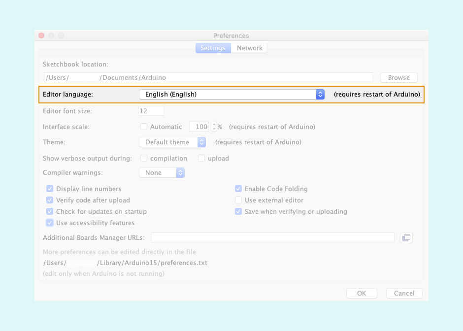

The Arduino IDE uses the system default language when you install and set up the IDE. If you like to work with a different language you can always change it to a language that you are comfortable working with.

---

1. Open the Arduino IDE.
2. Open preferences
   * Windows/Linux: `File > Preferences`.
   * macOS: `Arduino > Preferences`
3. Under Preferences, look for the Editor language option.

   

4. In the dropdown menu, look for the language you would like to use and select it, then click ok.
5. Close the IDE and reopen the IDE again to finalize the changes.
