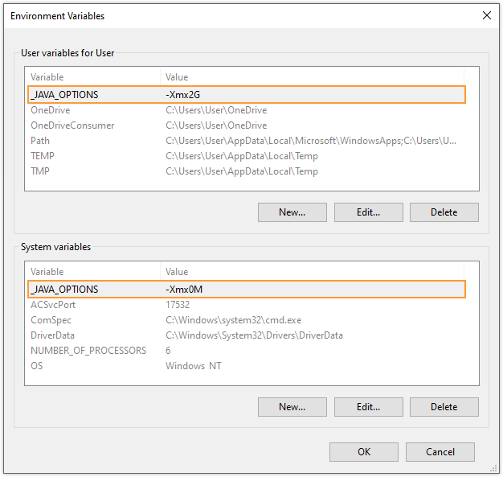

When launching Arduino IDE, you may get this error:

```
Error: Could not create the Java Virtual Machine.
Error: A fatal exception has occured. Program will exit.
```

Arduino IDE comes bundled with its own Java Runtime Environment, located within the application folder. You are **not** required to install Java yourself on your system. The error indicates that the Java Virtual Machine (JVM) could not be started, which can be caused by corrupted or incorrectly configured files in the Arduino IDE application folder, or conflicting system-level configuration for the Java environment.

---

## Check `arduino.l4j.ini`

One reason for the error can be an inproper option set in the `arduino.l4j.ini` file:

1. Open the Arduino IDE application folder, by default `C:\Program Files (x86)\Arduino`.

2. Open the file `arduino.l4j.ini` with a text editor.

3. Find the line starting with `-Xmx`. By default, it should be `-Xmx512M`. If this is not the case, change the line to read `-Xmx512M`.

4. Try launching Arduino IDE again.

---

## Run `arduino_debug.exe` and check environmental variables

1. Open the Arduino IDE application folder, located in `C:\Program Files (x86)\Arduino` by default.

2. Launch `arduino_debug.exe` and observe the output.

If the `_JAVA_OPTIONS` environmental variable has been set, it can interfer with Arduino IDE. You can check this by running `arduino_debug.exe`, which will notify you:

```
Picked up _JAVA_OPTIONS: -Xmx2G
Error occured during initialization of VM
Could not reserve enouch space for object heap
```

If the `-Xmx` option is set, you have two options:

**Temporary fix:**

> **Note:** Since changing or removing environment variables can affect other applications on your computer, it's recommended to save the value incase you want to restore it later.

1. Press <kbd>Win</kbd> + <kbd>X</kbd> or right-click the Start menu button to open the Power User menu.

2. In the Power User Task Menu, select the **System** option.

3. Click the **Advanced System Settings** link in the left column.

4. In the System Properties window, click the **Advanced** tab, then click the **Environment Variables** button near the bottom of that tab.

   

5. Under _User variables for User_, look for a `_JAVA_OPTIONS` variable. If there is one, click on it to select it, then either click **Delete** to remove it, or click **Edit** and remove the `-Xmx` option. Then do the same for _System variables_.

   

6. Click **OK** to close the Environment Variables window.

7. Click **Apply** to apply the changes.

---

## Reinstall Arduino IDE

If the `_JAVA_OPTIONS` variable is not set, reinstalling Arduino IDE is likely to resolve the issue. Get it from the [software page](https://www.arduino.cc/en/software).

---

## Use Arduino IDE 2.0

Newer versions of Arduino IDE runs without Java, avoiding the problem alltogether. [Get it here](https://www.arduino.cc/en/software#future-version-of-the-arduino-ide).
