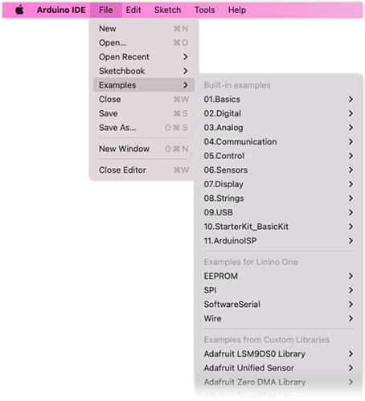

Learn where sketches, libraries, board platforms, and other files used by Arduino IDE are stored on your computer.

---

<a id="sketches"></a>

## Sketches

* Sketches are saved inside the [Sketchbook folder](https://support.arduino.cc/hc/en-us/articles/4412950938514) by default.
* Sketches have the `.ino` file extension.
* When saving a sketch, the IDE suggests a name based on the date, such as `sketch_nov17b.ino`.
* For Example sketches, see [Examples](#examples).


---

<a id="examples"></a>

## Examples

Example sketches can be found in the _File > Examples_ menu.



* **Built-in Examples:** Examples packaged with Arduino IDE. They are located inside the application folder.
  * In **Arduino IDE 2.0** they are stored in the `resources/app/node_modules/arduino-ide-extension/Examples` subfolder.
  * In **Arduino IDE 1.8** they are stored in the `libraries` subfolder for Windows and Linux, and `Contents/Java/libraries` on macOS.
* **Examples for \<board name\>:** Stored inside the board platform's `libraries` subfolder, e.g. `Arduino15/packages/arduino/hardware/avr/1.8.4/libraries/Wire`. These are only accessible by Arduino IDE when one of the boards from that package is selected from the _Tools > Board_ menu.
* **Examples from Custom Libraries:** Installed with the Library Manager or the _Sketch > Include Library > Add. ZIP Library_ dialog.
* **Examples for any board:** Installed with the Library Manager or the _Sketch > Include Library > Add. ZIP Library_ dialog. <!-- 1.x only? -->

When an Example is open, you can select _Sketch > Show Sketch Folder_ to reveal the location in your system's file manager.

---

<a id="libraries"></a>

## Libraries

**Libraries installed with the Library Manager** are stored inside a Sketchbook subfolder:

1. Open the Sketchbook folder (detailed instructions [here](https://support.arduino.cc/hc/en-us/articles/4412950938514)).
   * **Windows:** `C:\Users\{username}\Documents\Arduino`
   * **macOS:** `/Users/{username}/Documents/Arduino`
   * **Linux:** `/home/{username}/Arduino`

   > For detailed instructions, see [Open the Sketchbook](https://support.arduino.cc/hc/en-us/articles/4412950938514-Open-the-Sketchbook).

2. Open the `libraries` subfolder.

3. The files for each library are stored within a folder with the library name:

   ```
   Arduino
   └── libraries
        └── ArduinoBLE
            ├── CHANGELOG
            ├── LICENSE
            ├── README.md
            ├── examples
            ├── extras
            ├── keywords.txt
            ├── library.properties
            └── src
    ```

**Libraries included in board packages** are stored within the board package folder's `libraries` subfolder, see [Board platforms and cores](#boards).

<!-- To add or remove libraries, use the [Library Manager](https://docs.arduino.cc/software/ide-v1/tutorials/installing-libraries). -->

> **An easy way to find a library with examples:**
>
> 1. Open _File > Examples_ in the menu bar.
> 2. Put your cursor over the name of the library you want to find.
> 3. Select any of the library examples.
> 4. Select _Sketch > Show Sketch Folder_ from the menu bar.

---

<a id="boards"></a>

## Board platforms and cores

Board platforms installed with the Board Manager are stored inside the Arduino15 folder.

1. Open the Arduino15 folder (detailed instructions [here](https://support.arduino.cc/hc/en-us/articles/360018448279)).
   * **Windows:** `C:\Users\{username}\AppData\Local\Arduino15`
   * **macOS:** `/Users/{username}/Library/Arduino15`
   * **Linux:** `home/{username}/.arduino15`

   > For detailed instructions, see [Open the Arduino15 folder](https://support.arduino.cc/hc/en-us/articles/360018448279-Open-the-Arduino15-folder).

2. Open the `packages` folder.

3. Open the **package vendor** subfolder, e.g. `arduino`.

4. Open the `hardware` subfolder.

5. The files for each package is contained in a folder with the package name. Most packages keep the files inside a folder with the version number, although if using the Board Manager only one will be installed at a time. For example, these are the contents of the **Arduino AVR Boards** package:

   ```
   Arduino15
   └── packages
       └── arduino
           └── hardware
               └── avr
                   └── 1.8.4
                       ├── README.md
                       ├── boards.txt
                       ├── bootloaders
                       ├── cores
                       ├── extras
                       ├── firmwares
                       ├── installed.json
                       ├── libraries
                       ├── platform.txt
                       ├── programmers.txt
                       └── variants
   ```

---

<a id="ide"></a>

## Application files

The application folder contains the executable files used when running Arduino. The location and structure of these files depend on the system.

The default installations paths are:

* **Windows:** `C:\Program Files (x86)\Arduino`
* **macOS:** `/Applications/Arduino.app/Contents/Java`
* **Linux:** See [Open the Arduino IDE installation folder](https://support.arduino.cc/hc/en-us/articles/4412943340178-Open-the-Arduino-IDE-installation-folder#linux).

Generally, the contents of this folder should not be changed.

---

## Further reading

* [Where are the installed cores located?](https://support.arduino.cc/hc/en-us/articles/360012076960-Where-are-the-installed-cores-located-)
* [Where can I find the Arduino15 folder?](https://support.arduino.cc/hc/en-us/articles/360018448279-Where-can-I-find-the-Arduino15-folder-)
* [How to do a complete uninstall of the Arduino IDE?](https://support.arduino.cc/hc/en-us/articles/360021325733-How-to-do-a-complete-uninstall-of-the-Arduino-IDE)
* [How do I delete or uninstall a library from the IDE?](https://support.arduino.cc/hc/en-us/articles/360016077340-How-do-I-delete-or-uninstall-a-library-from-the-IDE-)
* [Installing Libraries (Arduino Docs)](https://docs.arduino.cc/software/ide-v1/tutorials/installing-libraries)
