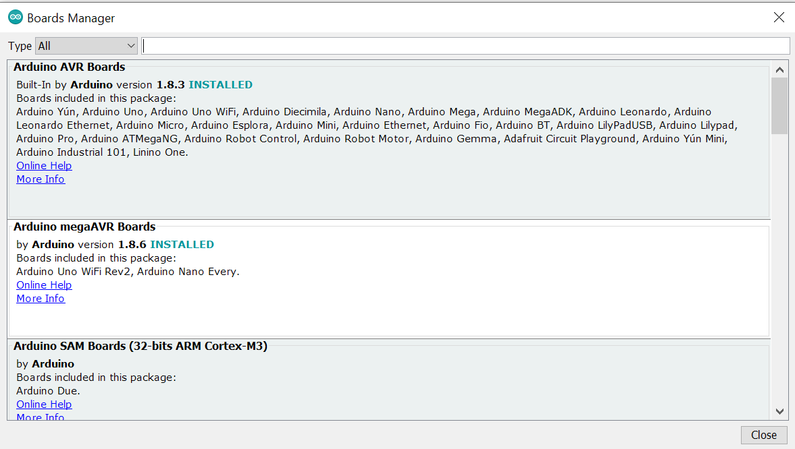
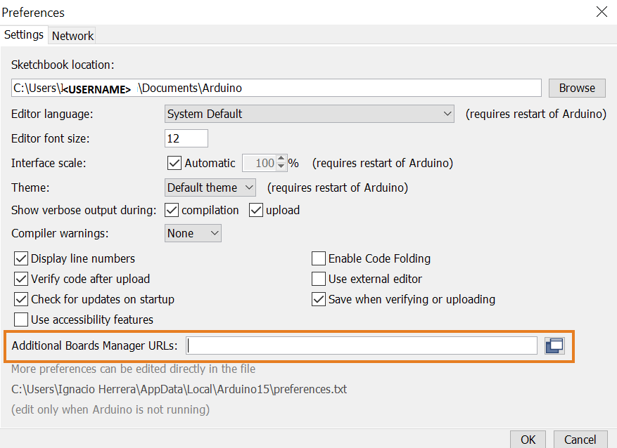

In order for Arduino IDE to recognize a board connected to the PC, it is required to install the corresponding core for that board's microprocessor. This way, when the board is plugged in, Arduino IDE will detect it and the corresponding port will show under _Tools > Port_ ready to be selected.

For Arduino boards it is very simple to install the core, but if your board is manufactured by a third party the procedure is different. Below both ways will be explained:

## Arduino boards

The core is available in the Arduino IDE software under the menu _Tools > Board > Boards Manager_.

Once the Boards Manager is open, you can just search the name of your board and the right core will show up in the search results. Then just click _Install_. Alternatively you can also search directly for the name of the core if you know it.

## Third Party boards

For 3rd party hardware packages, it is first necessary to add the URL of their Boards Manager JSON file in: _File > Preferences > Additional Boards Manager URLs_. The URLs point to JSON index files that Arduino IDE uses to build the list of available installed boards.

If you have multiple URLs in that field, you must separate them with commas. New boards will automatically be picked up by the Board Manager each time Arduino IDE is opened.

To find the most up to date list of URLs you can add, you can visit the list of third party board URLs on the [Arduino IDE wiki](https://github.com/arduino/Arduino/wiki/Unofficial-list-of-3rd-party-boards-support-urls#list-of-3rd-party-boards-support-urls).
