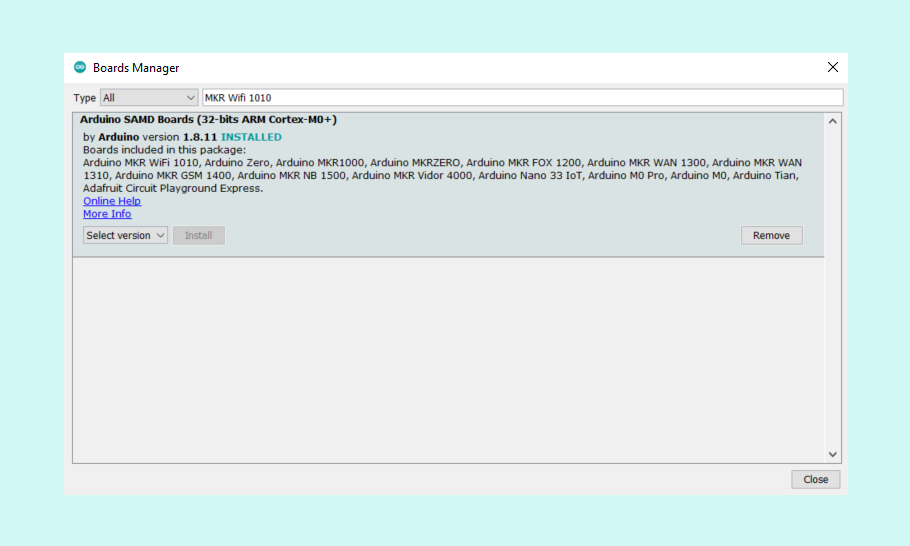

The Arduino IDE installation package comes with some cores by default. Periodically, updated versions of cores are released, with new features and bug fixes. Keeping your core updated will improve stability, performance, and compatibility.

---

To update the core check the availability in the Arduino IDE software under the menu `Tools > Board > Boards Manager`.

Once the Boards Manager is open, search for the name of your board or the name of the core. Find the correct core in the search results and hover over it with the mouse cursor. If a newer core is available, the `Update` button will be visible. Proceed by clicking on the `Update` button.

> Note: If `Update` is not visible this would indicate that you have an updated core and no further action would be needed.

