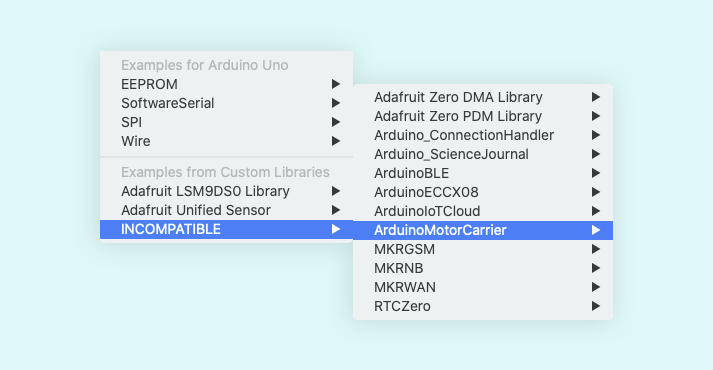

If a library sketch example appears in `File > Examples > INCOMPATIBLE` the currently selected board is not compatible with the library. For example, the Arduino UNO is incompatible with the `ArduinoMotorCarrier` library, and sketches from that library will appear in the `INCOMPATIBLE` category.

To use a sketch from this library, a supported board must be selected. To find out which boards are supported, search for the library in the Library Manager:

1. Open (`Tools > Manage Libraries...`).
2. Search for the library name, e.g. `ArduinoMotorCarrier`.
3. Click _More info_.

For Arduino libraries, this will open the [Arduino Library Reference](https://www.arduino.cc/reference/en/libraries/).

