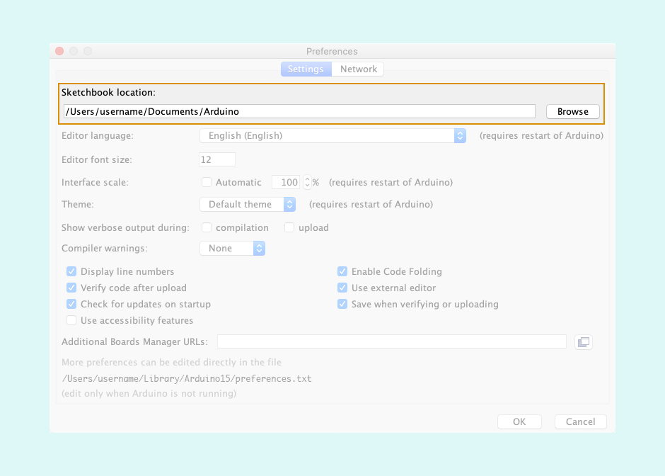

Learn how to open the Sketchbook on your system.

---

By default the Sketchbook is located in these directories:

* **Windows:** `C:\Users\{username}\Documents\Arduino`
* **macOS:** `/Users/{username}/Documents/Arduino`
* **Linux:** `/home/{username}/Arduino`

You can also find the location inside Arduino IDE, in Preferences under _Sketchbook location_:

* **Windows:** `File > Preferences`.
* **macOS:** `Arduino > Preferences`
* **Linux:** `File > Preferences`.

---

## Further reading

* [Find sketches, libraries, board cores, and other files on your computer](https://support.arduino.cc/hc/en-us/articles/4415103213714-Find-sketches-libraries-board-cores-and-other-files-on-your-computer)
