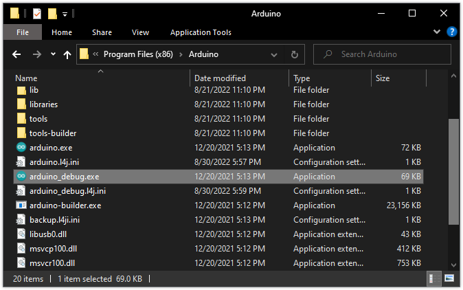
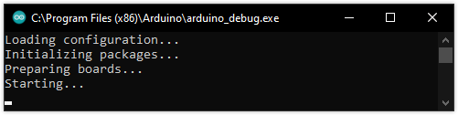
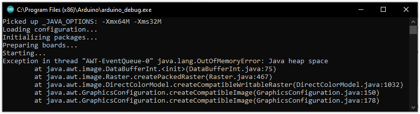

Arduino IDE 1.x for Windows includes an alternative executable that provides log output to use for troubleshooting problems with the IDE.

---

## Running `arduino_debug.exe`

1. Open File Explorer and navigate to the Arduino IDE application folder, located in `C:\Program Files (x86)\Arduino` by default.

2. Find the `arduino_debug.exe` file and double-click it to launch it.

   

3. The Windows command interpreter will open, and output relevant information as it attempts to start the IDE.

   

---

## Interpreting the output

_java.lang.OutOfMemoryError after launching Arduino IDE_

### `Picked up _JAVA_OPTIONS`

This message indicates that the `_JAVA_OPTIONS` environmental variable is configured on your system. While not an error in itself, the set options may cause problems when running the IDE. Be on the lookout for the `-Xmx` and `-Xms` flags, which control maximum and initial heap size (memory).

### `Exception in thread java.lang.OutOfMemoryError: Java heap space`

The maximum Java heap size was exceeded. Can be caused by a low setting for `-Xmx` (the default value is `-Xmx512M`).

### `Error occurred during initialization of VM`

A generic error indicating that the Java Virtual Machine could not be started.

---

## Checking the Java VM options

See the steps outlined in [Error: Could not create the Java Virtual Machine (Windows)](https://support.arduino.cc/hc/en-us/articles/360021218899-Error-Could-not-create-the-Java-Virtual-Machine-Windows-).

---

## If the command interpreter window doesn't open

Some errors may cause the cmd window to close almost immediately:

* Having the `Xms` (initial heap size) option lower than `Xmx` (max heap size),
* Allocating more memory than is physically available for your system.
* Allocating more memory than is possible for your Java Virtual Machine. For Arduino IDE 1.x on Windows, which is a 32-bit application, you are recommended to not exceed 1280 MB (`-Xmx1280M`).

Options set in the `_JAVA_OPTIONS` environmental variable are given priority over those set in the `arduino_debug.l4j.ini` configuration file.

<!-- Tags -->

   AWT-EventQueue-0

<!-- markdownlint-disable-file HC001 -->
