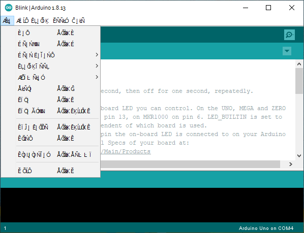

Using certain non-standard fonts with the Windows ClearType feature can result in unexpected characters in the text of the Arduino IDE's menus. It can be described as "gibberish", or a "garbled" appearance.

---

## Workaround

1. With a text editor, open the file `arduino.l4j.ini` that is located in the Arduino IDE installation folder.
2. Add the line `-Dawt.useSystemAAFontSettings=on` to the bottom of the file.
3. Save the file with the same filename as the original.
4. If open, restart the IDE.

### If you can't edit the file

On Windows, restrictive permissions may prevent you from making changes to `arduino.l4j.ini`.

1. Right click on the Arduino folder, choose 'Properties' and uncheck 'Read-only'.
2. Click the 'Security' tab
3. Click 'Edit...'
4. Select the group 'Users', or your username if available.
5. Check 'Full control' in the 'Allow' column

You should now be able to edit the file.

<!--
Problem replicated and solution confirmed in 1.8.13
Problem could not be replicated in 2.0.0-beta.3
-->
