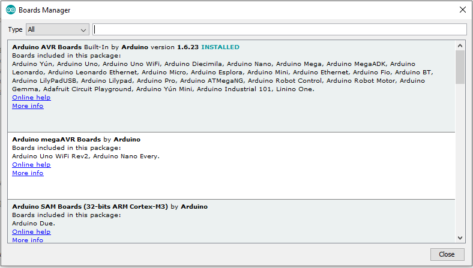

Cores are necessary to make new boards' microcontrollers compatible with your Arduino Software (IDE) and, possibly, the existing sketches and libraries. Starting from the Arduino Software (IDE) version 1.6.2, all Arduino AVR boards are saved inside the ‘Arduino’ installation folder (by default in Windows: `C:\Program Files (x86)\Arduino\hardware\arduino\avr`). However, newer Arduino boards require an additional core to be installed and are stored in a different folder in your PC. Boards Manager is the preferred tool to add cores to your Arduino Software (IDE) and it is also the best way to check and update the version of installed cores.

If you need to know where the new core files are located in your computer, see the list below that shows the directories to help you find them:

* On GNU/Linux: `~/.arduino15/packages/`
* On Windows: `%AppData%\Arduino15\packages\`
* On macOS: `~/Library/Arduino15/packages/`

On Windows if you create a folder named ‘portable’ right inside the Arduino main folder, all packages, libraries, and sketches will be stored there, thus keeping everything in one place. Great idea in case you have your Arduino on a USB flash drive or in Dropbox synced over multiple PCs.
