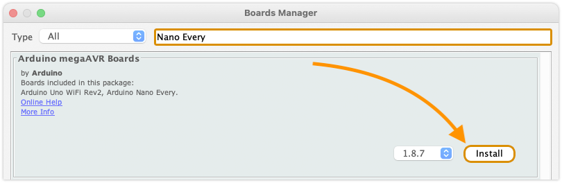
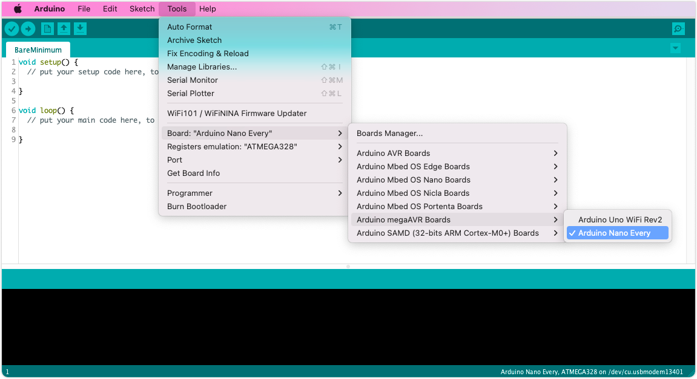

A **board core** (or just _board_ for short) is a collection of files needed to compile and upload sketches for a board. Cores are contained in _packages_, and can be installed using the Board Manager.

---

## Add a board with Board Manager

1. In the menu bar, open _Tools > Board > Boards Manager_.

2. Either search for the package name (e.g. "megaAVR"), or the board (e.g. "Uno", "MKR1000", or "Portenta"), by typing in the search field.

3. Find the package that includes your board.

4. Click **Install** (the latest version is selected by default).

   > If the package is already installed, you will instead have the option of installing a different version or removing the package.

5. Wait for the installation to complete.

You can now select boards from the installed packages in the _Tools > Board_ menu:

---

## Further reading

* [Add or remove third-party boards in Boards Manager](https://support.arduino.cc/hc/en-us/articles/360016466340-Add-or-remove-third-party-boards-in-Boards-Manager)
* [Uninstall boards using the Boards Manager](https://support.arduino.cc/hc/en-us/articles/4407225360018-Uninstall-boards-using-the-Boards-Manager)
