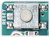

When uploading a sketch to your board you may get an error from the **avrdude** utlity:

* **stk500:**
  * [avrdude: stk500_recv(): programmer is not responding<br>avrdude: stk500_getsync() attempt X of 10: not in sync](#avrdude-stk500_recv-and-stk500_getsync)
  * [avrdude: stk500v2_ReceiveMessage(): timeout<br>avrdude: stk500v2_getsync(): timeout communicating with programmer](#avrdude-stk500_recv-and-stk500_getsync)
* **ser_open():**
  * [avrdude: ser_open(): can't open device \<port\>: no such file or directory](#avrdude-ser_open-cant-open-device-no-such-file-or-directory)
  * [avrdude: ser_open(): can't open device "/dev/ttyACM0": Device or resource busy](#ser_open-device-or-resource-busy)
  * [avrdude: ser_open(): can't open device \<port\>: Resource busy](#ser_open-resource-busy)
  * [avrdude: ser_open(): can't open device \<port\>: permission denied](#ser_open-permission-denied)
  * [avrdude: ser_open(): can't open device \<port\>: access is denied](#ser_open-access-is-denied)
* [avrdude: butterfly_recv(): programmer is not responding](#avrdude-butterfly_recv)
* [avrdude: usbhid_open(): No device found
  avrdude: jtag3_open_common()](#usbhid_open_jtag3_open_common)
* [avrdude: jtagmkII_getsync(): sign-on command: status -1](#jtagmkII_getsync)
* **[Other avrdude errors (general troubleshooting)](#check-the-following)**

> **Note:** The error text may be different depending on your system language.

---

<a id="check-the-following"></a>

## General troubleshooting checklist

Most errors can be solved by following these steps. After each step, try uploading your sketch again.

1. Make sure you have [selected the right board and port](https://support.arduino.cc/hc/en-us/articles/4406856349970-Select-board-and-port-in-Arduino-IDE) correct board under _Tools > Board_ and  _Tools > Port_.

   * For instructions, see [Select board and port in Arduino IDE](https://support.arduino.cc/hc/en-us/articles/4406856349970-Select-board-and-port-in-Arduino-IDE)

   * If your board is missing, see [If your board does not appear in the port menu](https://support.arduino.cc/hc/en-us/articles/4412955149586-If-your-board-does-not-appear-in-the-port-menu)

2. Close other instances of Arduino IDE, serial monitors, and other software that may be blocking the port. If this doesn't work, try restarting your computer.

3. Reset your board by pressing the RESET button (a white or blue push button).

   

4. Check port and cable connections:

   * Try disconnecting and reconnecting the board to the computer, and confirm that the power LED (often labeled "ON") is lit.

   * If possible, connect the board directly to a USB port. Avoid using a USB hub if possible, or try a different hub.

   * Make sure you are using a data transfer USB cable (charge-only cables will not work). Try connecting your board with a different cable, or testing your cable with a different device.

   * Remove any unneeded USB devices that may be using the ports.

5. Remove any connections to digital pins **0(RX)** and **1(TX)**. Anything connected to these pins can interfere with the upload transfer.

---

<a id="avrdude-stk500_recv-and-stk500_getsync"></a>

## avrdude: stk500_recv(): programmer is not responding<br>avrdude: stk500_getsync() attempt \<n> of 10: not in sync

```
avrdude: stk500_recv(): programmer is not responding
avrdude: stk500_getsync() attempt 1 of 10: not in sync: resp=0x00
avrdude: stk500_recv(): programmer is not responding
avrdude: stk500_getsync() attempt 2 of 10: not in sync: resp=0x00
...
```

1. Make sure you have [selected the right board and port](https://support.arduino.cc/hc/en-us/articles/4406856349970-Select-board-and-port-in-Arduino-IDE) correct board under _Tools > Board_ and  _Tools > Port_.

   * For instructions, see [Select board and port in Arduino IDE](https://support.arduino.cc/hc/en-us/articles/4406856349970-Select-board-and-port-in-Arduino-IDE)

   * If your board is missing, see [If your board does not appear in the port menu](https://support.arduino.cc/hc/en-us/articles/4412955149586-If-your-board-does-not-appear-in-the-port-menu)

2. If using the classic Nano, try selecting a different processor in _Tools > Processor_.

3. For some boards, a _loopback test_ can be performed, which will rule out problems with the serial chip. It can be done with the following boards:

   * Arduino Uno (classic)
   * Arduino Uno Rev3
   * Arduino Uno Rev3 SMD
   * Arduino Mega (classic)
   * Arduino Mega2560 Rev3
   * Arduino Mega ADK Rev3
   * Arduino Nano (classic)

   If the loopback test passes, or if you can't do a loopback test, reprogramming the bootloader may resolve the issue. [ArduinoISP](https://docs.arduino.cc/built-in-examples/arduino-isp/ArduinoISP) can be used for boards with AtMega chips. You can also search for [articles in the Help Center](https://support.arduino.cc/hc/en-us/search?utf8=%E2%9C%93&query=bootloader).

---

<a id="stk500v2_ReceiveMessage_getsync"></a>

## avrdude: stk500v2_ReceiveMessage(): timeout<br>avrdude: stk500v2_getsync(): timeout communicating with programmer

Make sure you have [selected the right board and port](https://support.arduino.cc/hc/en-us/articles/4406856349970-Select-board-and-port-in-Arduino-IDE) correct board under _Tools > Board_ and  _Tools > Port_.

---

<a id="avrdude-ser_open-cant-open-device-no-such-file-or-directory"></a>

## avrdude: ser_open(): can't open device: No such file or directory

```
avrdude: ser_open(): can't open device "/dev/cu.usbmodem14101": No such file or directory
Problem uploading to board. See http://www.arduino.cc/en/Guide/Troubleshooting#upload for suggestions.
```

This error can happen if the board on the selected port has been disconnected from the computer, or reassigned to a different port.

1. Make sure the correct port is selected in _Tools > Port_.

   * For step-by-step instructions, see [Select board and port in Arduino IDE](https://support.arduino.cc/hc/en-us/articles/4406856349970-Select-board-and-port-in-Arduino-IDE).
   * If you can't find the port, see [If your board does not appear in the port menu](https://support.arduino.cc/hc/en-us/articles/4412955149586-If-your-board-does-not-appear-in-the-port-menu).

2. If using the classic Nano, try selecting a different processor in _Tools > Processor_.

> On Windows, you can [manually set a port for the board](https://support.arduino.cc/hc/en-us/articles/360016420140#set-COM-port) to stop it from being reassigned.

---

<a id="ser_open-device-or-resource-busy"></a>

## avrdude: ser_open(): can't open device \<port\>: Device or resource busy

1. Make sure the correct port is selected in _Tools > Port_.

2. Close other instances of Arduino IDE, serial monitors, and other software that may be blocking the port.

3. Restart your computer.

4. See [Find and stop process blocking a port](https://support.arduino.cc/hc/en-us/articles/4407830972050-Find-and-stop-process-blocking-a-port).

---

<a id="ser_open-resource-busy"></a>

## avrdude: ser_open(): can't open device \<port\>: Resource busy

1. Make sure the correct port is selected in _Tools > Port_.

2. Close other instances of Arduino IDE, serial monitors, and other software that may be blocking the port.

3. Restart your computer.

4. See [Find and stop process blocking a port](https://support.arduino.cc/hc/en-us/articles/4407830972050-Find-and-stop-process-blocking-a-port).

---

<a id="ser_open-permission-denied"></a>

## avrdude: ser_open(): can't open device \<port\>: Permission denied

This error can occur on Linux if your user account is part of the `dialout` group. See  [Fix port access on Linux](https://support.arduino.cc/hc/en-us/articles/360016495679-Fix-port-access-on-Linux) to resolve the issue.

---

<a id="ser_open-access-is-denied"></a>

## avrdude: ser_open(): can't open device \<port\>: access is denied

1. Make sure the correct port is selected in _Tools > Port_.

2. Close other instances of Arduino IDE, serial monitors, and other software that may be blocking the port.

3. Restart your computer.

4. See [Find and stop process blocking a port](https://support.arduino.cc/hc/en-us/articles/4407830972050-Find-and-stop-process-blocking-a-port).

---

<a id="avrdude-butterfly_recv"></a>

## avrdude: butterfly_recv()

```
avrdude: butterfly_recv(): programmer is not responding
avrdude: error: buffered memory access not supported. Maybe it isn't
a butterfly/AVR109 but a AVR910 device?
avrdude: initialization failed, rc=-1
         Double check connections and try again, or use -F to override
         this check.

avrdude: butterfly_recv(): programmer is not responding
avrdude: error: programmer did not respond to command: leave prog mode
avrdude: butterfly_recv(): programmer is not responding
avrdude: error: programmer did not respond to command: exit bootloader
```

Make sure you have [selected the right board and port](https://support.arduino.cc/hc/en-us/articles/4406856349970-Select-board-and-port-in-Arduino-IDE) correct board under _Tools > Board_ and  _Tools > Port_.

For instructions, see [Select board and port in Arduino IDE](https://support.arduino.cc/hc/en-us/articles/4406856349970-Select-board-and-port-in-Arduino-IDE).

---

<a id="usbhid_open_jtag3_open_common"></a>

## avrdude: usbhid_open(): No device found<br>avrdude: jtag3_open_common()

```
avrdude: usbhid_open(): No device found
avrdude: jtag3_open_common(): Did not find any device matching VID 0x03eb and PID list: 0x2145
An error occurred while uploading the sketch
```

Make sure you have [selected the right board and port](https://support.arduino.cc/hc/en-us/articles/4406856349970-Select-board-and-port-in-Arduino-IDE) correct board under _Tools > Board_ and  _Tools > Port_. In particular, this error can occur when uploading to an Arduino Uno Rev3 or classic, when having _megaAVR Boards > Arduino Uno WiFi Rev2_ as the selected board.

---

<a id="jtagmkII_getsync"></a>

## avrdude: jtagmkII_getsync(): sign-on command: status -1

Make sure you have [selected the right board and port](https://support.arduino.cc/hc/en-us/articles/4406856349970-Select-board-and-port-in-Arduino-IDE) correct board under _Tools > Board_ and  _Tools > Port_.

---

## Still need help?

* Visit the [Avrdude, stk500, Bootloader issues category](https://forum.arduino.cc/c/using-arduino/avrdude-stk500-bootloader-issues/81) in the Arduino forum.

* [Contact us](https://www.arduino.cc/en/contact-us/).

> **Please include this information:**
>
> * A [verbose error output](https://support.arduino.cc/hc/en-us/articles/4407705216274)
> * The name of your board
> * Your operating system
> * Your Arduino IDE version

<p style="display:none;">
   Tags: \\.\com1, \\.\com2, \\.\com3, \\.\com4, \\.\com5, \\.\com6, \\.\com7, \\.\com8, \\.\com9
</p>

<!-- markdownlint-disable-file HC001 -->
