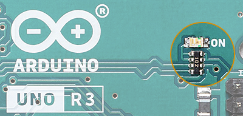
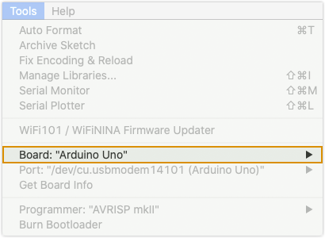
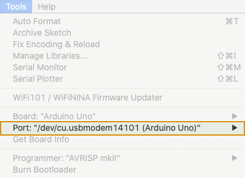

When there is an error the IDE will print relevant information in the console. Learn how to resolve common errors.

---

## Quick checks

* Check that the board is powered. The power LED should be lit (typically marked ON or POWER) on the board. If not, [check your connections](#check-your-connections).

* In the `Tools` menu option, check that the correct `Board` and `Port` are selected.

* Make sure you are clicking the  **Upload** button and not the  **Verify** button.

## Compilation errors

Your sketch cannot be uploaded to the board unless it compiles. Many compilation errors will contain a line number where the error occurred.

If you're unsure whether your error is due to compilation, you can click the  **Verify** button. This will compile and verify the sketch without uploading it to the board. When the sketch is compiled correctly the output will look similar to this.

```
Sketch uses 924 bytes (2%) of program storage space. Maximum is 32256 bytes.
Global variables use 9 bytes (0%) of dynamic memory, leaving 2039 bytes for local variables. Maximum is 2048 bytes.
```

[Learn more about compilation errors and how to resolve them](https://support.arduino.cc/hc/en-us/articles/4402764401554).

## Board and port selection

| Error        | Solution |
| ------------- | ------------- |
| `Error: 2 UNKNOWN: no FQBN provided`                          | [Select a board](#check-board-selection)        |
| `Error: 2 UNKNOWN: uploading error: no upload port provided`  | [Select a port](#check-port-selection)          |
| `Compilation error: Error: 2 UNKNOWN: platform not installed` | [Install missing platform](#check-the-platform) |

## Error: avrdude

* `avrdude: stk500_recv(): programmer is not responding`
* `avrdude:stk500_getsync() attempt X of 10: not in sync`
* `avrdude: butterfly_recv(): programmer is not responding`
* `avrdude: ser_open(): can't open device "portName": no such file or directory`
* `avrdude: ser_open(): can't open device "portName": the system cannot find the file specified.`
* `avrdude: ser_open(): can't open device "portName": access is denied.`
* `avrdude: ser_open(): can't open device "portName": permission denied`
* `avrdude: ser_open(): can't open device "portName": the semaphore timeout period has expired.`
* `avrdude: stk500v2_getsync(): timeout communicating with programmer`

To learn more about these errors and how to resolve them, [see this page](https://support.arduino.cc/hc/en-us/articles/4401874331410).

## Is your error not listed?

Make a search using the error code in the [help center](https://support.arduino.cc/hc/en-us) or the [forum](https://forum.arduino.cc/).

---

## Solutions

<!-- HTML HEADING FOR ID -->
<h3 id="power">Check that your board is powered</h3>

The power LED should be lit (typically marked ON or POWER) on the board.



If not, [check the board connections](#check-your-connections). If this does not resolve the problem, [contact us](https://www.arduino.cc/en/contact-us/).

<!-- NOTE: https://support.arduino.cc/hc/en-us/articles/360018922219-My-board-PWR-Led-does-not-turn-on -->

<!-- HTML HEADING FOR ID -->
<h3 id="check-your-connections">Check board connections</h3>

1. Make sure the USB cable is fully inserted into your board and PC.

2. Check that your USB cable is working. Test it with a different device, or try using a different USB cable. Make sure it is a *data* cable, a charge-only cable will not work.

3. The black anti-static foam that some boards are shipped with can interfere with the board. If it's attached to the board, remove it.

4. Remove any connections to digital pins **0(RX)** and **1(TX)**. These pins are used for communication with your computer. Connecting anything to these pins can interfere with uploading. You can attach the components back to these pins once the program has been successfully uploaded.

5. If you're using a USB hub, try connecting the board directly to a USB port on the computer.

6. If possible, try a USB 2.0 port.

7. Make sure any required drivers for the USB serial chip on your Arduino are installed.
<!-- How? -->

<!-- HTML HEADING FOR ID -->
<h3 id="check-board-selection">Check board selection</h3>



Make sure you have selected the correct board in `Tools > Board`. Most common boards are found in the `Arduino AVR Boards` package.

If you're unsure which package your board is in, or if that package is missing from the list, go to the Boards Manager `Tools > Board > Board Manager...` and search for your board name. Find the package that includes your board in the listed boards, and note the package name. If it's not installed, click *Install* to install the latest version (selected by default). If you have an older version, click *Update*.

You can now select your board under `Tools > Board`, under the board package name.

<!-- HTML HEADING FOR ID -->
<h3 id="check-port-selection">Check port selection</h3>



Make sure you have selected the port of your Arduino board from the `Tools > Port` menu. The correct port may be labeled with the board name, but not always. If you are unsure which port your board is connected to, try disconnecting it. Then reconnect it, and take note if a new port appears.

<!-- HTML HEADING FOR ID -->
<h3 id="check-the-platform">Check that your platform is installed</h3>

1. Open the Board Manager through the menu.

   `Tools > Board > Board Manager...`.

2. Search for your board name, and find the package with your board listed. Note the package name.

3. If it's not installed, click `Install`. The IDE will install the platform, and an *INSTALLED* label will display next to the package name.

4. Close the Board Manager.

5. Select your board under your package name in `Tools > Board` menu.

## Additional methods

### Bootloader reset

If you have a board with native USB (e.g. Leonardo, Micro, MKR), a *bootloader reset* can resolve the problem.

1. Connect the board to the computer.

2. Ensure you've selected the right serial port in the IDE.

3. Hit the reset button on the board.

4. Within two seconds after pressing the reset button, click  **Upload**.

### The loopback test

If your board is an Uno, Mega, or Nano board, you can do a [loopback test](https://support.arduino.cc/hc/en-us/articles/360020366520). This will rule out faulty hardware.

If the loopback test passes, the problem may be due to a corrupted bootloader. In this case, burning a fresh bootloader may solve the issue. Keep in mind that this is an advanced procedure. Use the links below to get started.

* [General overview on bootloader burning](https://www.arduino.cc/en/Tutorial/BuiltInExamples/ArduinoISP)
* [Using an Atmel ICE Programmer with an MKR board](https://support.arduino.cc/hc/en-us/articles/360014905199)
* [Using two Arduino Mega boards](https://support.arduino.cc/hc/en-us/articles/360012048060)
* [Using two Arduino UNO boards](https://support.arduino.cc/hc/en-us/articles/360012048080)
* [Burning the Nano using a UNO](https://support.arduino.cc/hc/en-us/articles/360012048100)

## Still need help?

* Visit the [Installation & Troubleshooting category](https://forum.arduino.cc/c/18) in the Arduino forum.
* [Contact us](https://www.arduino.cc/en/contact-us/).

<p style="display:none;">
   Tags: problem uploading to board, problema subiendo a la placa, http://www.arduino.cc/en/guide/troubleshooting#upload, 360003198300, 上传失败, 上传出错, 업로드, problème de téléversement vers la carte, téléverser, проблема загрузки в плату, マイコンボードに書き込めない, マイコンボードに書き込もうとしましたが、エラーが発生しました, problem beim hochladen auf das board, problema di caricamento sulla scheda, 업로딩
</p>
