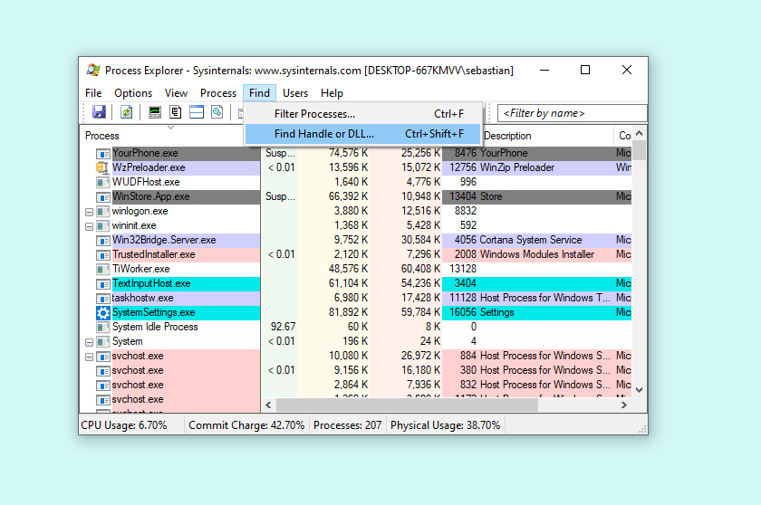
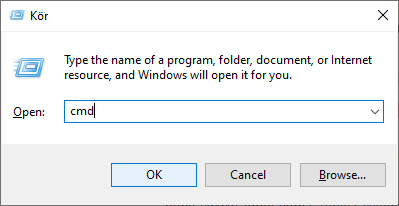

Learn how to find and stop a process blocking a port for your system (Windows, macOS and, Linux).

---

## Windows

### Get the Process Explorer tool

Download and install the [Process Explorer tool](https://docs.microsoft.com/sv-se/sysinternals/downloads/process-explorer) from Microsoft.

### 1. Find the port 'Service' value

Identify the port designation in the IDE error output, such as `COM3`.

Open the Device Manager. This can be done by pressing `Windows + X` on your keyboard to open the Power User menu, and selecting **Device Manager**.

Expand the Ports section and find the device using the port (the device may or may not show the board name). Right-click the device and click **Properties**.


Next, open the **Details** tab and select "Service" in the Property dropdown. Right-click the value displayed in the field below and click **Copy**.


### 2. Find the process name

Open the Process Explorer that you installed earlier. Open `Find > Find Handle or DLL...`.



Paste your copied value into the search field and click **Search**. The search should return the process using the port.


The process name may be sufficient for you to identify the process and stop the associated application. Otherwise, proceed with the following steps.

### 3. Stop the process

Press `Windows + R` on your keyboard to open the Run window, enter "cmd" and click **OK**. This will open the Command Prompt.



In the Command Prompt, enter the following command, replacing `<Process Name>` with the name from the previous step.

```
taskkill /IM <Process Name> /F
```

With our example, it would be:

```
/IM arduino-cli.exe /F
```

When successful, it should return something like:

```
SUCCESS: The process "arduino-cli.exe" with PID 15880 has been terminated.
```

Try uploading your sketch again. If this resolves the issue, and you already tried restarting your computer, the process that's blocking the port is probably being run on startup. [Learn how to configure startup apps here](https://support.microsoft.com/help/4026268).

## macOS

Identify the port designation in the IDE error output, such as `usbmodem`.

Open Terminal. You can find it with Spotlight by pressing `CMD + Space` and entering "Terminal".

Input the following command, replacing `<port name>` with your port.

```
lsof -n | grep <port name>
```

In this case the resulting output was:

```
lsof -n | grep /dev/cu.usbmodem141401
arduino-c 19772 <your_username>   14u      CHR               18,3      0t5661                1023 /dev/cu.usbmodem141401
```

The first value returned is the **process name**, which in this case it `arduino-c`. This is because another instance of the IDE is running with the Serial Monitor open. The second value, in this case `19772`, is **the Process identifier (PID)**. We can get more info with this command (replace `<PID>` with the PID in your input):

```
ps -p <PID>
```

The output will look something like this:

```
PID    TTY  TIME     CMD
19772  ??   0:11.81  /Applications/Arduino IDE.app/Contents/Resources/app/node_modules/arduino-ide...
```

Note the path under **CMD**. Using the process name or path may be able to find and close an application that's running the process. You can also try stopping the process in the Activity Monitor (again, you can use `CMD + Space` and search for 'Activity Monitor'). Otherwise, we can terminate the process with this command:

```
kill <PID>
```

If the process still doesn't stop:

```
kill -9 <PID>
```

If this resolves the issue, the process that's blocking the port is likely being run on startup. Startup apps can be configured in `System Preferences > Users & Groups > Login Items`.

## Linux

```
lsof -Kin | grep ttyACM0
```

The output will look something like this:

```
arduino-c  10392  <your_username> 13u  CHR  166,0  0t0  474  /dev/ttyACM0
```

The first value returned is the **process name**, which in this case it `arduino-c`. This is because another instance of the IDE is running with the Serial Monitor open. The second value, in this case `19772`, is **the Process identifier (PID)**. We can get more info with this command (replace `<PID>` with the PID in your input):

```
lsof -p 10392 | grep cwd
arduino-c 10392 <your_username> cwd       DIR                8,5     4096 1705472 /home/<your_username>/Downloads/arduino-ide_2.0.0-beta.2_Linux_64bit
```

Note the path in the last parameter. Using the process name or path may be able to find and close an application that's running the process. Otherwise, we can terminate the process with this command:

```
kill <PID>
```

If the process still doesn't stop:

```
kill -9 <PID>
```
