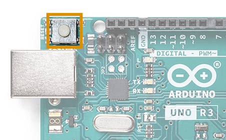

Learn what to do if your board does not appear in the port selection menu in Arduino IDE.

---

## Check if the computer is detecting a device on the port

Two cases should be separated:

* The computer recognizes the board as a device, but not as an Arduino board. The port is listed in the port menu, but the board name is not displayed, and sketches cannot be uploaded ([read this if using the classic Nano](#nano)).
* The board is not being registered by the computer at all.

To check whether the board is being recognized as a device, follow these steps:

1. Disconnect your board from your computer.

2. Open the port list `Tools > Port`. Some ports may still be listed. Take note of this, and close the menu.

3. Connect your board to your computer.

4. Open `Tools > Port`. The port your board is connected to should now appear as a new port in the list.

Continue with the following steps depending on the result:

* [No device was detected](no-device-recognized)
* [Incorrect device detected](device-recognized)

---

<h2 id="no-device-recognized">If no device is detected</h2>

### Check board connections

> **Note:** If the port menu is open, you need to close and re-open it for the list to refresh.

The most common reason for the board not being displayed on a port are a failing USB connection.

1. The board needs to be connected to your computer with a data USB cable.
2. Make sure the USB cable is not damaged. Test your cable with a different device, or try using a different cable.
3. Try using a different USB port on your computer.
4. If possible, connect the board directly to your computer instead of a through a hub.
5. Remove all connections to the board pins, especially to **0(RX)** and **1(TX)**.

### Reset the board

The board may be stuck in a state where it cannot communicate on the port.

1. Find the reset button on the board.

2. Click the button two times in succession.

   

3. Check the port menu again.

> **Note:** If the port menu is open, you need to close and re-open it for the list to refresh.

---

<h2 id="device-recognized">If a device is detected incorrectly</h2>

### Check the USB-to-Serial firmware

If your board is an **Arduino Uno** (Rev1 or Rev3) or an **Arduino Mega**, the USB-to-Serial firmware may be corrupted.

**Windows:**

1. Open the Device Manager.
2. Check the _Other Devices_ section.

**macOS:**

1. Open the _System Information_ app.
2. Check the _Hardware > USB_ section.

**Linux:** Use a device manager of your choice, such as **hardinfo** To install hardinfo, open Terminal and run `sudo apt install hardinfo`. Then run `hardinfo` to open and look in _Devices > USB Devices_).

<!-- sudo apt-get install hardinfo? -->

Missing or corrupted USB-to-Serial firmware can cause Uno and Mega boards to be recognized as any of the following:

* Unknown Device
* Unknown USB Device
* Composite Device
* USB Device
* ATmega16u2 DFU
* Atmega8U2 DFU

If your board is listed with one of these names you can resolve the issue by [flashing the USB-to-serial firmware in DFU mode](https://support.arduino.cc/hc/en-us/articles/4408887452434-Flash-USB-to-serial-firmware-in-DFU-mode).

<h3 id="nano">If you're using the classic Nano</h3>

Unlike most other boards, the board name will not be displayed for a port where an Arduino Nano is connected.

1. Disconnect your board from your computer.

2. Open the port list `Tools > Port`. Some ports may still be listed. Take note of this, and close the menu.

3. Connect your board to your computer.

4. Open `Tools > Port`. The port your board is connected to should now appear as a new port in the list.

---

## Still need help?

* Visit the [Installation & Troubleshooting category](https://forum.arduino.cc/c/18) in the Arduino forum.
* [Contact us](https://www.arduino.cc/en/contact-us/)
