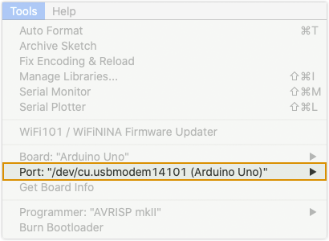
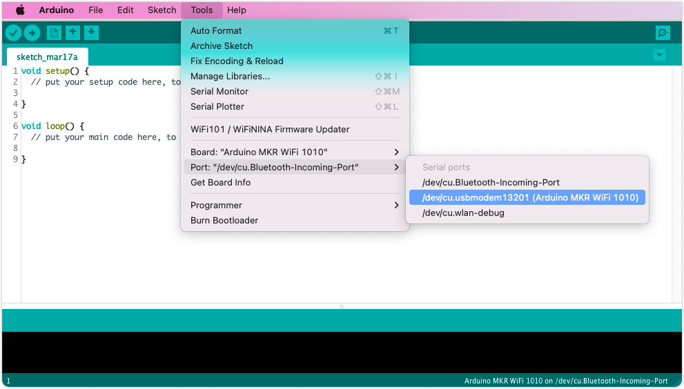

Learn how to find the name of the port your board is connected to.

---

## Select board

1. Click on _Tools_ in the menu bar.

2. Find the _Board_ row. The currently selected board will be selected.

   

3. Hover over the _Board_ row to reveal the installed board packages. These packages contain some popular boards:

   | Package                                      | Boards                                                                      |
   |----------------------------------------------|-----------------------------------------------------------------------------|
   | Arduino AVR boards                           | Arduino Uno, Arduino Mega, Arduino Nano                                     |
   | Arduino SAMD (32-bits ARM Cortex-M0+) Boards | MKR Zero, MKR WiFi 1000, MKR WiFi 1010                                      |
   | Arduino SAM (32-bits ARM Cortex-M3) Boards   | Arduino Due                                                                 |
   | Mbed OS Nano boards                          | Arduino Nano 33 BLE, Arduino Nano 33 BLE Sense, Arduino Nano RP2040 Connect |

   If you don't know which package to use, or if it's missing from the list, see [Find and install the board core in Arduino IDE](https://support.arduino.cc/hc/en-us/articles/360016119519-How-to-add-boards-in-the-board-manager).

4. Click on a board to select it.

   

> **Note:** If you don't know which package to use, or if it's missing from the list, see Find and install the board core in Arduino IDE.
<!-- TODO: Add links to article -->

---

## Select port

1. Click on _Tools_ in the menu bar.

2. Find the _Port_ row. The currently selected board will be selected.

   

3. Hover over the _Port_ to reveal all ports. For Arduino devices, the board name will typically be displayed after the port.

   Port naming varies by system:

   * Windows: `COM3 (Arduino Uno)`
   * macOS: `/dev/cu.usbmodem14101 (Arduino Uno)`
   * Linux: `/dev/ttyACM0 (Arduino Uno)`

4. Click on a port to select it.

   

   If you don't see your board in the list, see [If your board does not appear in the port menu](https://support.arduino.cc/hc/en-us/articles/4412955149586-If-your-board-does-not-appear-in-the-port-menu).
