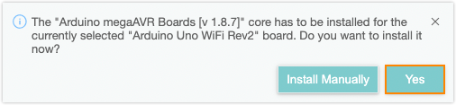

> Board-specific quickstart guides are available in [Arduino Docs](https://docs.arduino.cc/).
>
> 

## 1. Open Arduino IDE

If you haven't done so already, download Arduino IDE from the [software page](https://www.arduino.cc/en/software). You can find [installation instructions here](https://support.arduino.cc/hc/en-us/articles/360019833020).

## 2. Connect the board to your computer

Next, connect to board to your computer with a USB cable. This will both power the board and allow the IDE to send instructions to the board. You'll need a data USB cable (a charge-only cable will not work), with connectors that fit both the board and your computer.

Arduino boards use different USB connectors:

* USB-B (UNO Rev3, UNO WiFi Rev2, Mega boards)
* Mini-B USB (Nano)
* Micro-B (Nano Family boards (except the classic Nano), MKR Family boards)
* USB-C (Portenta boards, UNO Mini Limited Edition)

The most common USB connector is USB-A, but newer laptop computers may only have USB-C.

> **Note:** When connecting your board Arduino IDE may ask if you want to install missing board files.
>
> In IDE 1, click _Install this package_:
>
> 
>
> In IDE 2, click _Yes_.
>
> 

## 3. Select board

Next, you need to tell Arduino IDE which board your sketch is for.

1. Click on _Tools_ in the menu bar and find the _Board_ row. If a board is currently selected it will be displayed here.

   

2. Hover over the _Board_ row to reveal the installed board packages. These packages contain some popular boards:

   | Package                                      | Boards                                                                      |
   |----------------------------------------------|-----------------------------------------------------------------------------|
   | Arduino AVR boards                           | Arduino Uno, Arduino Mega, Arduino Nano (classic)                           |
   | Arduino megaAVR boards                       | Arduino Uno WiFi Rev2, Arduino Nano Every                                   |
   | Arduino SAMD (32-bits ARM Cortex-M0+) Boards | MKR Zero, MKR WiFi 1000, MKR WiFi 1010, and other MKR boards                |
   | Mbed OS Nano boards                          | Arduino Nano 33 BLE, Arduino Nano 33 BLE Sense, Arduino Nano RP2040 Connect |

   > **Troubleshooting:** If you don't know which package to use, or if it's missing from the list, see [Add a board to Arduino IDE](https://support.arduino.cc/hc/en-us/articles/360016119519-How-to-add-boards-in-the-board-manager).

3. Click on a board to select it.

   

## 4. Select port

1. Click on _Tools_ in the menu bar and find the _Port_ row. If a board is currently selected it will be displayed here.

   

2. Hover over the _Port_ to reveal all ports. For Arduino devices, the board name will typically be displayed after the port.

   Port naming varies by system:

   * Windows: `COM3 (Arduino Uno)`
   * macOS: `/dev/cu.usbmodem14101 (Arduino Uno)`
   * Linux: `/dev/ttyACM0 (Arduino Uno)`

3. Click on a port to select it. If the port with your board is already selected you don't have to do anything. If you don't see your board in the list, see [If your board does not appear in the port menu](https://support.arduino.cc/hc/en-us/articles/4412955149586-If-your-board-does-not-appear-in-the-port-menu).

   

   > **Troubleshooting:** If you don't see your board in the list, see [If your board does not appear in the port menu](https://support.arduino.cc/hc/en-us/articles/4412955149586-If-your-board-does-not-appear-in-the-port-menu).

## 5. Upload a sketch

1. Write a sketch, or use an Example such as [Blink](https://www.arduino.cc/en/Tutorial/BuiltInExamples/Blink) (_File > Examples > 01.Basics > Blink_).

2. **Optional:** Click the  **Verify** button to try compiling the sketch and check for errors.

3. Click the  **Upload** button to program the board with the sketch.

Your sketch will start running on the board. It will run again each time the board is reset.

## Troubleshooting

* Make sure you've followed the steps before, especially selecting the board and port correctly.
* If you can't find your board in the port menu, see [If your board does not appear in the port menu](https://support.arduino.cc/hc/en-us/articles/4412955149586-If-your-board-does-not-appear-in-the-port-menu).
* If you get an upload error, see [Errors when uploading a sketch](https://support.arduino.cc/hc/en-us/articles/4403365313810-Errors-when-uploading-a-sketch).
