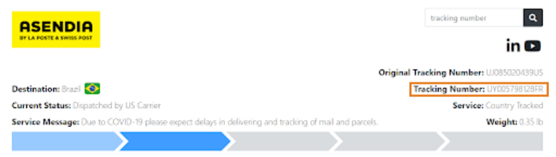

Yes, of course! Once the order is fulfilled and shipped, you’ll receive an email with the tracking number in order to follow your shipment.

Please note that orders shipped to **NON-US** or **NON-EU** countries may be subject to local import taxes (VAT and Duties), and that local courier companies may charge a service fee in addition to the original shipping costs.

Please, notice that NON-US orders shipped via DHL Parcel International Standard or Asendia are going to be delivered by the local postal service. In this case, many countries create a **local tracking number** for these parcels. It can be found in the **right corner**  at the page of your international tracking number.

If the received link does not work or gives any error, you can easily track your parcel on the internet, too.
Go, for example, to any of these webpages:

* [https://www.trackingmore.com/](https://www.trackingmore.com/)
* [https://www.aftership.com/](https://www.aftership.com/)
* [https://www.track-trace.com/](https://www.track-trace.com/)
* [https://www.17track.net/](https://www.17track.net/)

Then write or paste your tracking number into the field.
If you are shown several options, you can choose your carrier (FedEx, UPS, DHL, GLS etc.) and this will give you more information.
The page will open a pop-up window, which includes the tracking details of your parcel.
