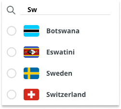

When viewing items in the Arduino Store, the prices and availability of products will be displayed based on your selected country or location. Learn how to view and change your location in the Arduino Store.

---

Follow these steps:

1. Open [store.arduino.cc](https://store.arduino.cc/) in your browser.

1. Your currently selected location is displayed in the bottom-left corner:

   

1. To change it, click the displayed location and then select a new one from the list.

   You can filter the list of countries by typing into the text field above the list:

   
