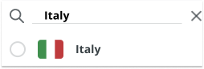

When viewing items in the Arduino Store, the prices and availability of products will be displayed based on your location. Learn how to change your location in the Arduino Store.

---

Follow these steps:

1. Click the **Change location** button in the top-right.

   

2. Find your country in the list of countries.

   > [!TIP]
   > You can filter the list of countries by typing into the text field above the list.
   >
   > 

3. Click on a country to select it.
