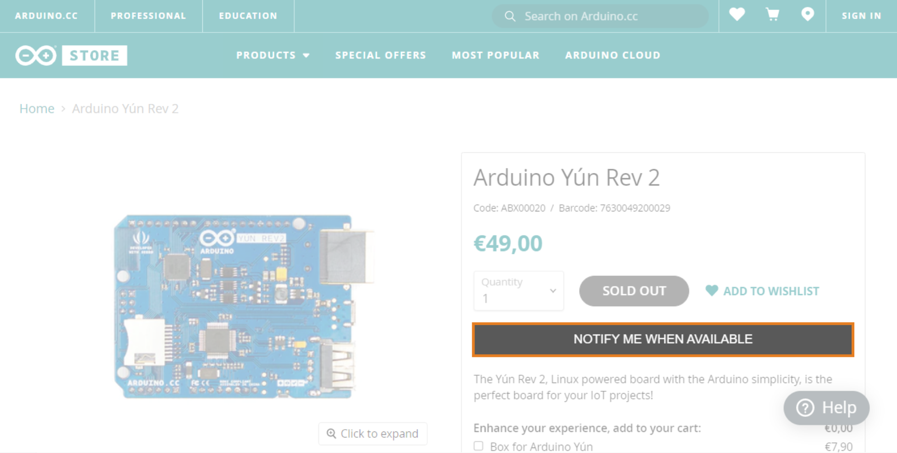
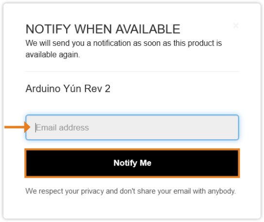

Learn how to get email notifications when sold out items are available again.

---

1. Go to the [Arduino Store](https://store.arduino.cc/) and find the item you need.

2. If the item is sold out, click on the *NOTIFY ME WHEN AVAILABLE* button on the right side of the page.

   

3. A popup will appear. Enter your email address in the text box.

4. Click on the *NOTIFY ME* button at the bottom of the popup.

   
