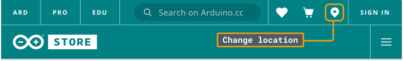
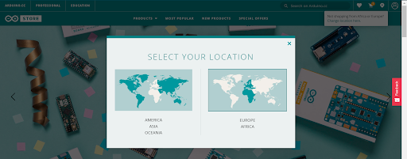

During the checkout process you will need to select your country for shipping purposes however in case you can't find it, it is due to the fact that you need to change the location of the store.

To do so, click on the location icon at the top right corner and select the option accordingly, America/Asia/Oceania or Europe/Africa.

