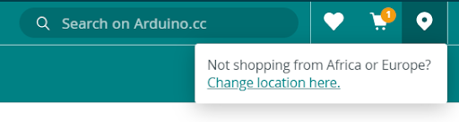

The Arduino online store manages two different currencies depending on your location.

First, check on which location you are by using the location icon at the top right corner and select the option accordingly, America/Asia/Oceania or Europe/Africa.

In case you have selected:

* America/Asia/Oceania, the prices displayed in the online store are in USD (American dollars).
* Europe/Africa, the prices displayed in the online store are in Euros.
