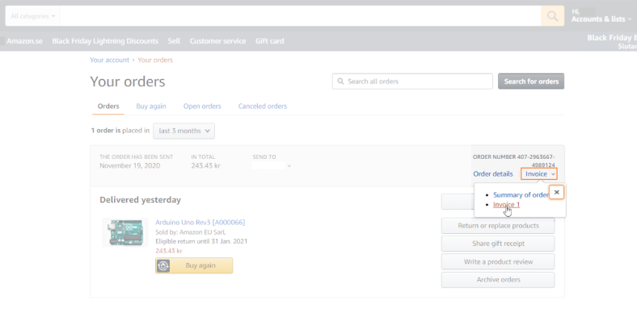

Learn how to get an invoice after purchasing Arduino products from the Arduino Store or Amazon.

## Arduino Store invoice

1. Visit the [Arduino store](https://store.arduino.cc/).

2. Add items to your cart and proceed to checkout.

3. On the checkout page, choose "I need an invoice".

   

4. You will be prompted to log in to your account if not already logged in.

5. Input your VAT ID number and/or other fiscal identification information in the "VAT Number" text box.

6. Complete the form and finish the checkout process.

7. Your invoice will be sent to the email associated with your Arduino account upon payment.

## Amazon invoice

When you purchase Arduino products on Amazon, an invoice is automatically generated using the information you provided during the purchase.  The invoice will be available soon after the shipment of your order. To find your invoice, follow the steps below:

1. Sign in to your Amazon account (make sure you are signed in to the same account used for your purchase).

2. Click on "Account & Lists" in the top-right, then select "Your orders."

3. Locate your order and click on "Invoice".

   

4. A new tab will open with your invoice.

If you encounter any issues during this process, please contact Amazon support for assistance.
