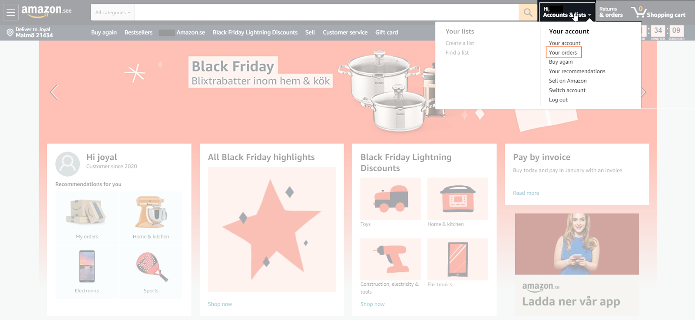
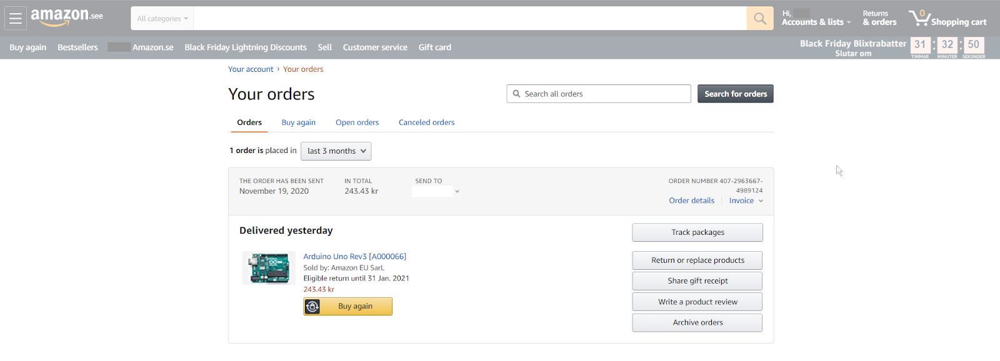
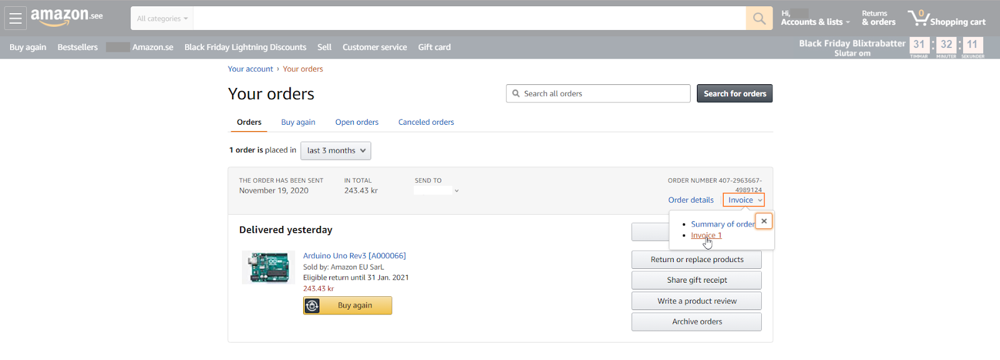

Learn how to get your invoice after purchasing Arduino products from the Arduino Store or Amazon.

## Arduino Store Invoice

When you purchase from the [Arduino store](https://store.arduino.cc/) and choose to pay by **Paypal / Stripe / bank transfer**, the invoice will be automatically sent to the email connected with your Arduino account at the moment of payment.

## Amazon invoice

When you make your Arduino purchase from Amazon, the invoice is auto-generated by Amazon with the details you provide at the time of purchase. The invoice will be available to you in your portal soon after the shipment of your order. Amazon sends you the invoice directly from their end. To find your invoice, please follow the steps below.

1. Open your Amazon account and make sure you have signed in using the same account used for your purchase.

2. Click on the Accounts & Lists dropdown and select **'Your orders'** option as shown in the picture below.

   

3. You will be taken to a page which includes your orders.

   

4. Click on the **Invoice** option which is next to the Order details and under the order number.

   

5. As soon as you click on the invoice you will be redirected to a new tab with the invoice.

In case you have any issues during the process or if you have not received the invoice under `Your orders` you will have to contact Amazon support as the invoice is auto-generated with the information provided during the order process.
