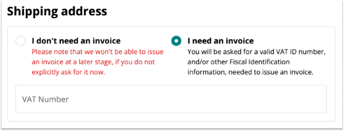

This guide outlines the steps for placing a tax-exempt order.

## Europe and Africa

### Eligibility for Tax Exemption

Customers with a VAT identification number valid in the VIES system will receive an invoice. Those without a valid VAT number for the VIES system will receive a standard cash sale receipt.

### How to make a Tax-Exempt order

To place a tax-exempt order, follow these steps:

1. Ensure you are logged into your account.

1. Select the "I Need an Invoice" Option

    

1. Input your VAT number in the designated field.

1. Proceed with the checkout process as usual to complete your order.

## America, Asia, and Oceania

### Eligibility for Tax Exemption

Customers who provide their company or school information in the designated field at checkout will receive an invoice. If personal information is entered, a standard cash sale receipt will be issued.

### How to make a Tax-Exempt order

1. Reach out to our [customer service](https://www.arduino.cc/en/contact-us) and provide your tax-exempt documentation.

1. Our team will verify your tax-exempt status.

1. Once verified, we will update your account to reflect your tax-exempt status.

1. After your account is updated, you can make purchases without any taxes applied.

If a client is not exempt, they will be charged taxes, and we will issue an invoice or a cash sale based on whether the company field is filled out.

## Receiving your Invoice or Receipt

For more details on how to find your receipt or invoice, please visit our [Find Your Receipt or Invoice](https://support.arduino.cc/hc/en-us/articles/360016121859-Find-your-receipt-or-invoice) page.
