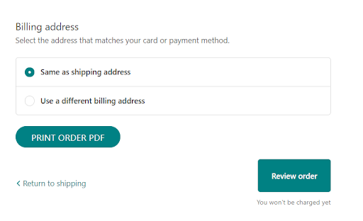
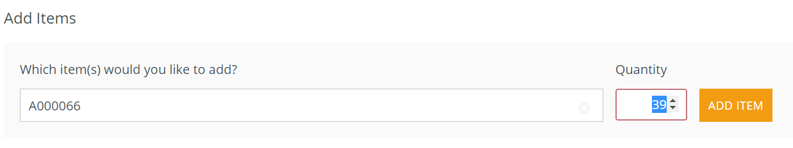
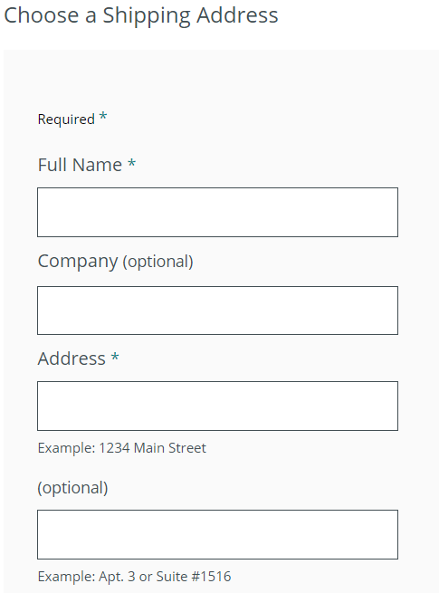
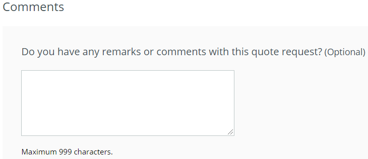
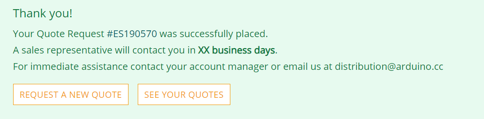

In order to receive your estimate, you should enter our store with your account, then add desired products to your cart. You can then go to checkout, complete with shipping/billing address and preferred shipping method.
Finally, going ahead with the "payment section" (without proceeding with payment), you'll be able to see the button "PRINT ORDER PDF" and receive your quote.

## Distributors

For the distributors we have a separate store, which can be accessed [here](https://distribution.arduino.cc/).

1. As soon as you log in, you can find the `Request a quote` button in the top right corner.

   

2. You can choose the product you are interested in, and the quantity you need. then click on `Add item`.
   

   If you are interested in more than one product, you will need to add all of them to the quote request.

3. After that, you will be requested to choose or type in the shipping address.
   

   If there is any comment or information you would like to add to the request, please write it into the textbox at the bottom of the page.
   

4. When you are finished, please click on the `Submit Quote Request` button.
Your quote has been created!
   

5. By clicking on `See your quotes`, you can see all your previous quote requests. If you choose the most recent one, you will be able to download it in pdf format.
   
