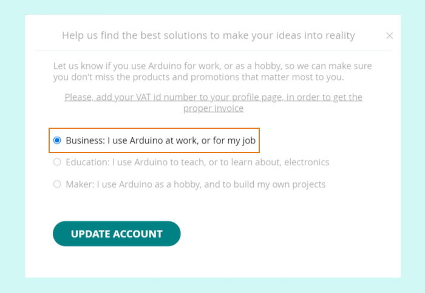

Learn about placing an order as an educator, business, or distributor.

---

## Educators

**[Learn how to create an Educator account here](https://store.arduino.cc/pages/educators)**

## Business

Business accounts may be eligible for a variable discount on Arduino products (excluding Education products), depending on the quantities ordered.

1. Create an Arduino account.
2. When signing in for the first time, click on the *Business* option in the pop-up.
3. Click *Update*.

## Distributors

If you are a distributor, please use the **distributor's store**.

* **[Enroll as a distributor](https://www.arduino.cc/en/become-distributor)**
* **[Sign in to the distributor's store](https://distribution.arduino.cc/)**

For larger orders, you can [request a quote](https://support.arduino.cc/hc/en-us/articles/360022125620).
