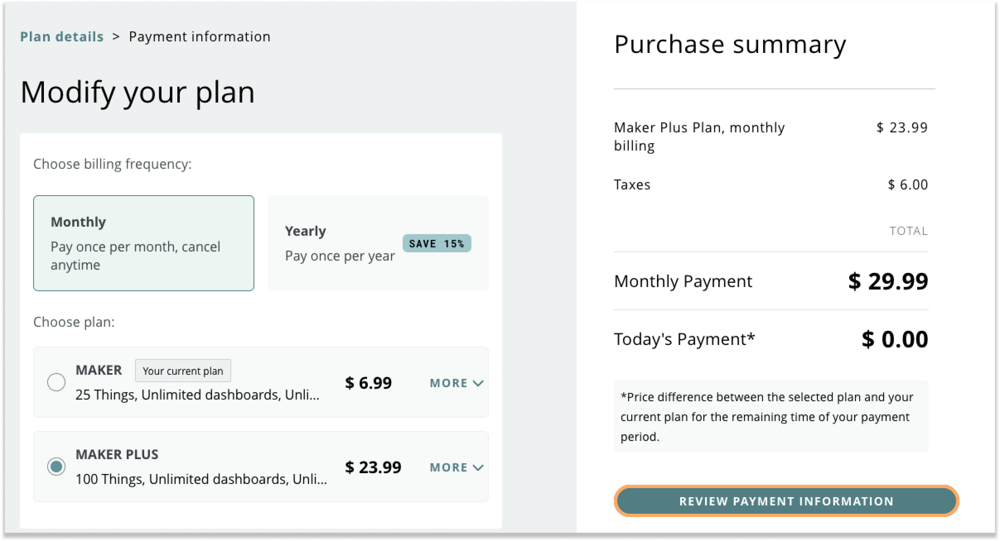

Learn how to remove a payment method from your Arduino account.

> [!NOTE]
> If your account is currently associated with an active subscription plan, you will not be able to delete the saved credit card. Arduino requires a valid credit card to be on file while a subscription is active. Once your current subscription expires, you will be able to remove your credit card information from your account.

---

1. Navigate to [Arduino.cc](https://www.arduino.cc/) and ensure that you're logged into your Arduino account.

1. Click on your profile icon located on the top right of the screen

1. Click on **My Plans**

1. Click on **Modify Plans**

1. Select any plan from the available options.

    > [!NOTE]
    > This step is necessary to access the payment settings; the specific plan you choose won't affect the process.

1. Click on **Review Payment Information**.

1. Under the **Payment Method** section, select the payment method and click **Delete**.

1. Select **Yes, Delete** in the pop-up. 

