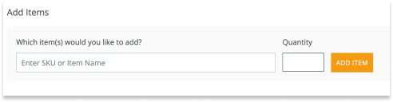
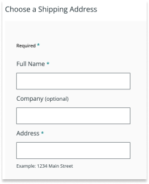
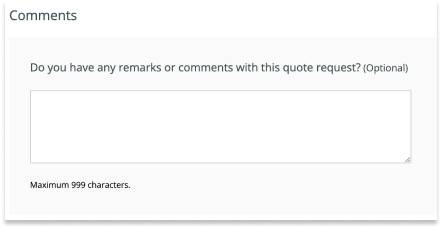

Learn how to request and manage quotes as an Arduino Distributor in the [Arduino B2B Store](https://distribution.arduino.cc/).

In this article:

* [Request a quote](#request)
* [Overview and manage quotes](#overview)

---

## Request a quote

1. Log in to the [Arduino B2B Store](https://distribution.arduino.cc/).

2. Click the **Request a Quote** button in the top right corner.

   ![Arduino B2B Store navigation menu highlighting the 'Request a Quote' button, alongside the 'Welcome [User Name]' and 'Quick Order' buttons](img/Distributors_Request_a_quote_button.png)

   > [!NOTE]
   > On smaller screens, use the  menu in the top right and select **Request a Quote** at the bottom.

3. Enter the SKU number or item name, specify the quantity, and click **Add Item**.

   

4. To add more items, repeat step 3 for each additional item.

5. Enter the shipping address.

   

6. If necessary, add comments to the quote request in the textbox at the bottom of the page.

   

7. Click on the **Submit Quote Request** button.

   

8. A confirmation message will appear when your quote request has been submitted.

   

> [!TIP]
> To download your quote as a PDF, click **See Your Quotes** in the confirmation message, then select the latest quote and click **Download as PDF**.

---

## Overview and manage quotes

Follow the steps below to check the details of a quote or download it as a PDF.

1. Log in to the [Arduino B2B Store](https://distribution.arduino.cc/).

2. Click on the **Welcome [Your Name]** button at the top right to open the **Account Overview** menu.

   ![Arduino B2B Store navigation menu highlighting the 'Welcome [User Name]' button, alongside the 'Request a Quote' and 'Quick Order' buttons](img/Distributors_Welcome_username.png)

3. In the **Account Overview** menu, find the **Purchases** column and click on **Quotes**.

   

   > [!NOTE]
   > On smaller screens, use the  menu in the top right and open **My Account > Purchases > Quotes**

4. You can now view all your quotes:

   * Click on a quote number to view its details.
   * To download a quote as a PDF, select a quote and click **Download as PDF**.
