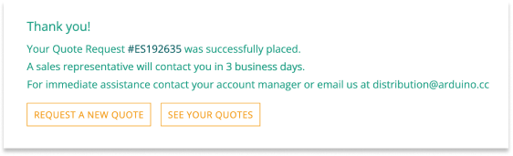
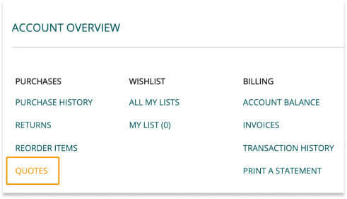

Learn how to request and manage quotes as an Arduino Distributor in the [Arduino B2B Store](https://distribution.arduino.cc/).

In this article:

* [Request a quote](#request)
* [Overview and manage quotes](#overview)

---

## Request a quote

1. Log in to the [Arduino B2B Store](https://distribution.arduino.cc/).

2. Click the **Request a Quote** button in the top right corner.

   ![Arduino B2B Store navigation menu highlighting the 'Request a Quote' button, alongside the 'Welcome [User Name]' and 'Quick Order' buttons](img/Distributors_Request_a_quote_button.png)

   > [!NOTE]
   > On smaller screens, use the  menu in the top right and select **Request a Quote** at the bottom.

3. Fill out the form:

   * _Add items._ Enter the SKU number or item name, specify the quantity, and click **Add Item**.

     Repeat for each additional item.

   * _Choose a Shipping Address._ Enter the shipping address information.

   * _Comments (optional)._ Provide additional information about your request.

4. Click on the **Submit Quote Request** button.

5. A confirmation message will appear when your quote request has been submitted.

   

> [!TIP]
> To download your quote as a PDF, click **See Your Quotes** in the confirmation message, then select the latest quote and click **Download as PDF**.

---

## Overview and manage quotes

Follow the steps below to check the details of a quote or download it as a PDF.

1. Log in to the [Arduino B2B Store](https://distribution.arduino.cc/).

2. Click on the **Welcome [Your Name]** button at the top right to open the **Account Overview** menu.

   ![Arduino B2B Store navigation menu highlighting the 'Welcome [User Name]' button, alongside the 'Request a Quote' and 'Quick Order' buttons](img/Distributors_Welcome_username.png)

3. In the **Account Overview** menu, find the **Purchases** column and click on **Quotes**.

   

   > [!NOTE]
   > On smaller screens, use the  menu in the top right and open **My Account > Purchases > Quotes**

4. You can now view all your quotes:

   * Click on a quote number to view its details.
   * To download a quote as a PDF, select a quote and click **Download as PDF**.
