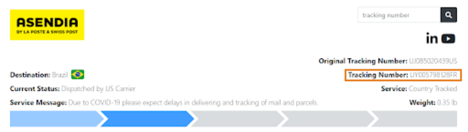
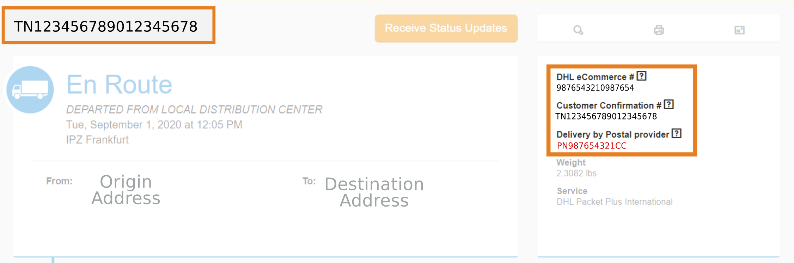

After an order is placed in the Arduino Store, the package is picked up and delivered by a 3rd party carrier. Once the goods have been shipped, you will receive a shipping confirmation email, that includes a tracking number and information about the shipping method selected. Account users can also see a summary of the orders in the [account section](https://store.arduino.cc/account) of the Arduino Store.

Learn more about the delivery process:

* <a href="#delivery-time">Delivery time</a>.
* <a href="#cancel-or-modify-an-order">Cancel or modify an order</a>.
* <a href="#track-an-order">Track an order</a>.
* <a href="#possible-fees">Possible additional fees charged by the carrier</a>.
* <a href="#if-a-parcel-did-not-arrive">If a parcel did not arrive</a>.

---

## Delivery time

Delivery time changes depending on the selected carrier and destination country as indicated in the checkout phase. Carrier delivery time does not include the order processing period. Arduino Srl and Arduino LLC cannot be held responsible for the carrier's late deliveries. See the [available shipping methods]() and their estimated delivery times. <!--- TODO add link to Available shipping methods article--->

### Order processing time

#### Europe and Africa

All orders addressed to Europe and Africa are shipped from Arduino's EU warehouse located in Parma (IT). Note that the warehouse is closed on the weekends.

* Orders entered before 11:00 am CET (GMT+1) Mon-Fri ship the same day.
* Orders entered after 11:00 am CET (GMT+1) Mon-Fri ship the next business day.

#### America (incl. USA), Asia and Oceania

All orders addressed to America, Asia and Oceania are shipped from Arduino's US warehouse located in Lakewood (NJ). Note that the warehouse is closed on the weekends.

* Orders entered before 2PM ET (GMT-5) Mon-Thu will be shipped on the same day.
* Orders entered before 12PM ET (GMT-5) Fri will be shipped on the same day.
* Orders entered after 12PM ET (GMT-5) Fri will be shipped on the next business day.

---

## Cancel or modify an order

After an order is placed it is processed and sent to a carrier. If the order information clears and the items are in stock, it is impossible to change the order. This includes adding or removing items, changing the shipping information, or cancelling the order.

If you want to return your order and receive a refund you can reject to receive the delivery from the shipping carrier. The shipment will be returned free of charge, and we will process your refund. Please [contact us](https://www.arduino.cc/en/contact-us/) for additional questions.

---

## Track an order

Most carriers provide a tracking page where you can track your order. To do so:

1. Go to the shipping confirmation email and copy the tracking number.
2. Search for the selected carrier's tracking page.
3. Paste the tracking number into the text field.

Alternatively, you can use one of the following websites to track your order:

* [https://www.trackingmore.com/](https://www.trackingmore.com/)
* [https://www.aftership.com/](https://www.aftership.com/)
* [https://www.track-trace.com/](https://www.track-trace.com/)
* [https://www.17track.net/](https://www.17track.net/)

### Deliveries by the local post

For orders addressed to America, Asia and Oceania, the [FedEx Ground® Economy](https://www.fedex.com/en-us/shipping/ground/economy.html), [DHL Parcel International Standard](https://www.dhl.com/us-en/home/ecommerce-solutions/shipping-services.html) and Asendia shipping methods utilize the local postal service for the final delivery. These shipping methods might have longer delivery times (up to a month for orders outside the USA), and are more difficult to track.

For the FedEx Ground® Economy shipping method, the tracking number provided works in both FedEx's and USPS’s tracking systems.

Some countries create a local tracking number for orders outside the USA. This number can be found on the right side of the carrier's order receipt:

---

## Possible additional fees charged by the carrier

Orders shipped to territories outside the USA and EU may be subject to local import taxes (VAT and Duties), and local courier companies may charge a service fee in addition to the original shipping costs.

Also, your carrier might request the payment of additional fees due to the customs clearance process performed at the parcel's destination country. The customs fees are regulated by the local authorities in the destination country. That fact makes it impossible to predict if you will be charged customs fees when ordering a product from the Arduino store. Ordered parcels will be returned to the Arduino's warehouses if this fee is not paid to the carrier.

>Even though it is impossible to predict if additional fees will occur, in some cases, albeit slower, deliveries made by the local postal services are less likely to be charged customs fees.

---

## If a parcel did not arrive

In some rare cases, an order might not be delivered to the customer even if it appears as delivered when tracking the parcel. This mostly happens when using shipping methods that don't have proof of delivery.

If the parcel did not arrive, please check the following before contacting [Arduino's customer support](https://store.arduino.cc/store-support):

* Check if other people living in the same delivery address or a neighbour have picked up the parcel.
* Check around the entrance(s) of your residence, particularly on back porches, bushes, garages, grills, or other places that might protect your package from theft or weather.

> Note that carriers may also use plastic bags to protect your package from the weather.

---

## Further reading

* [Shipping policy](https://store.arduino.cc/pages/shipping-policy?selectedStore=eu) Europe and Africa store.
* [Shipping policy](https://store-usa.arduino.cc/pages/shipping-policy) America, Asia and Oceania store.

<!--- TODO: add link to "Available shipping methods"--->
