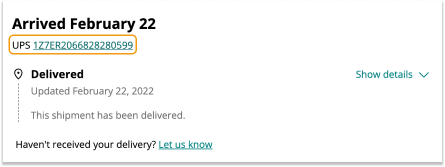

In rare cases, an order might not reach its destination even when the tracking displays it as delivered. This is more common with shipping methods that don't offer proof of delivery.

Here are a few steps to follow if a delivery is missing:

1. See if someone else at your delivery address or a nearby neighbor have picked up the parcel.

1. Check for messages or updates from the shipping provider to see if your package might have been dropped off at a pickup point. You can also review the tracking information provided by the shipping partner.

    

1. Ensure your address details are accurate and up to date.

1. Check around the entrance(s) of your residence, particularly on back porches, bushes, garages, grills, or other places that might protect your package from theft or weather.

> Note that carriers may also use plastic bags to protect your package from the weather.

### What to do next?

If you've completed these steps and still can't locate the missing package, please contact [Arduino's customer support](https://www.arduino.cc/en/contact-us/) within 30 day.
